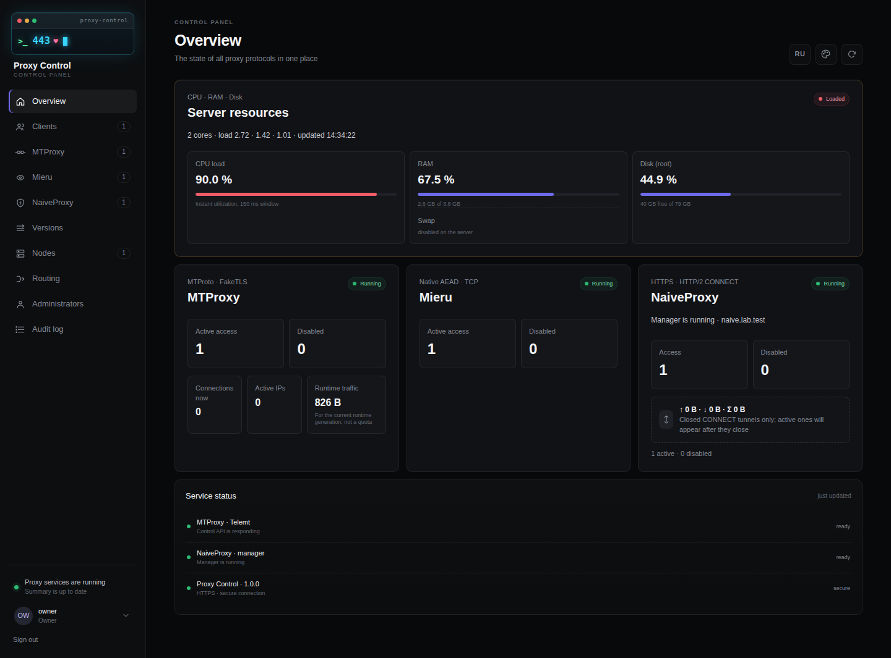
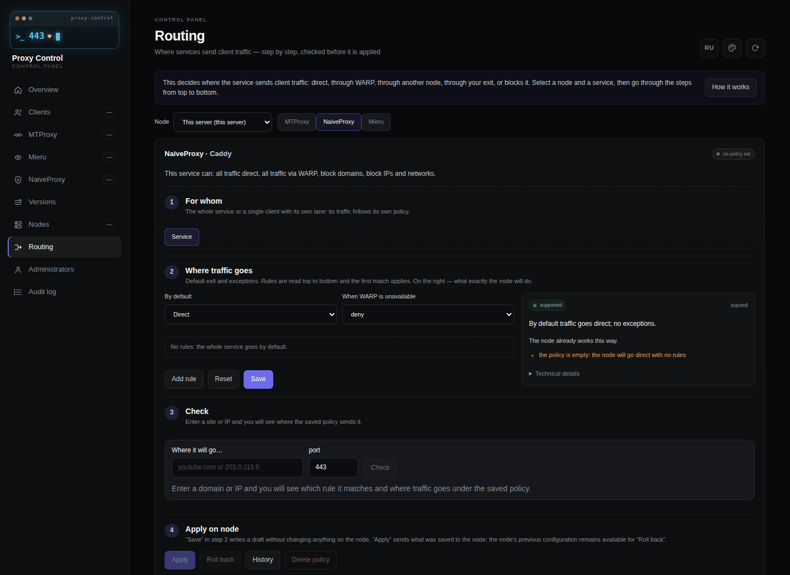

**English** · [Русский](README.md)

<div align="center">

# Proxy Control

**A proxy control panel that can run on the same server as 3x-ui**

MTProxy, NaiveProxy and Mieru under one panel — with a transactional installer that
either finishes the installation or returns the server to the state it was in.

[](https://github.com/dubr1k/proxy-control/actions/workflows/test.yml)
[](LICENSE)

[What it is](#what-it-is) · [Requirements](#requirements) · [Installation by a human](#installation-by-a-human) · [Installation by an AI agent](#installation-by-an-ai-agent) · [Updating](#updating) · [Documentation](#documentation)

</div>

<p align="center"></p>

> [!NOTE]
> **Current release: [v1.1.1](https://github.com/dubr1k/proxy-control/releases/tag/v1.1.1).**
> What changed is in the [release notes](https://github.com/dubr1k/proxy-control/releases/tag/v1.1.1)
> and the [changelog](CHANGELOG.md).

> [!IMPORTANT]
> This project is for people who know what DNS, TLS, Nginx and Docker are. The installer
> takes care of the routine and refuses to take a dangerous step silently, but it does not
> replace understanding your own server.

## Contents

- [What it is](#what-it-is)
- [Interface](#interface)
- [How the shared port 443 works](#how-the-shared-port-443-works)
- [Requirements](#requirements)
- [Domains and certificates](#domains-and-certificates)
- [Installation by a human](#installation-by-a-human)
- [Installation by an AI agent](#installation-by-an-ai-agent)
- [After installation](#after-installation)
- [Updating](#updating)
- [Day-to-day operation](#day-to-day-operation)
- [Features in detail](#features-in-detail)
- [When something does not work](#when-something-does-not-work)
- [What is inside](#what-is-inside)
- [Documentation](#documentation)
- [Security](#security)
- [Development](#development)
- [License and acknowledgements](#license-and-acknowledgements)

## What it is

Proxy Control is a separate control panel for MTProxy, NaiveProxy and Mieru proxies, their
users and accesses. It is neither an add-on nor a fork of 3x-ui: install it on a clean server
or next to a running 3x-ui — then both panels share port 443 without getting in each other's
way. The installer can also install 3x-ui for you.

| Component | What it gives you |
|---|---|
| **MTProxy / Telemt** | A Telegram proxy: `tg://` links and QR codes, limits, expiry, service health. |
| **NaiveProxy** | An HTTPS proxy that looks like an ordinary website from outside. HTTP/1.1 CONNECT and HTTP/2 CONNECT over TLS/TCP with one access for both; per-user quota and traffic accounting. |
| **Mieru** | A traffic-obfuscating proxy with its own protocol over TCP; a one-time `mierus://` link and QR. |
| **Next to 3x-ui** | The `existing` mode adopts an installed 3x-ui: it shares port 443 with it and never changes its files. The `managed-new` mode installs 3x-ui `3.9.0` on a clean server and creates VLESS Reality (TCP and XHTTP) and Hysteria2. 3x-ui stays managed in its own panel. |
| **Clients and subscriptions** | One client holds grants to every protocol and one revocable link `https://<subscription domain>/s/<token>` for sing-box/Karing, Clash/mihomo and others. Credentials are stored under a master key (AES-256-GCM). |
| **Linked panels (Fleet)** | A central panel issues grants on other servers running Proxy Control over HTTPS with a `node-sync` API key. |
| **Routing** | Outbound traffic rules per node and service: direct, through WARP, your own exit or another node; blocks by domain, CIDR, geosite and geoip through the optional Xray-router. |
| **Updates** | The «Versions» screen updates Telemt, NaiveProxy, Mieru, the Xray-router and the panel itself with a backup and rollback; the whole server updates with one command. |
| **MCP and AI skills** | An optional MCP server on the central panel: the panel API as tools for Claude Code and Claude Desktop, irreversible actions only with `confirm`. |
| **Panel** | Owner, admin and viewer roles; API keys scoped `admin \| monitor \| node-sync`; a secret-free audit; Russian and English interface. |

Traffic accounting differs between protocols and the panel does not hide it: Telemt
separates the process counter from quota usage, NaiveProxy counts bytes only after a
tunnel closes, and Mieru shows `unavailable` when there is no safe per-user counter.

## Interface

Panel captures from an isolated lab with test data — no keys, QR codes or production
node addresses.

| Overview | Step-by-step routing |
|---|---|
| [](docs/releases/assets/v1.0.0/dashboard-en.png) | [](docs/releases/assets/v1.0.0/routing-en.png) |

[Mobile overview](docs/releases/assets/v1.0.0/dashboard-phone.png) · [Clients with search](docs/releases/assets/v1.0.2/clients.png) · [Access window](docs/releases/assets/v1.0.2/grant-window.png) · [Clients on a phone](docs/releases/assets/v1.0.2/clients-phone.png) · [Built-in guide](docs/releases/assets/v1.0.0/routing-guide.png) · [Russian overview](docs/releases/assets/v1.0.0/dashboard.png) · [Russian routing](docs/releases/assets/v1.0.0/routing.png) · [Sign-in](docs/releases/assets/v1.0.0/login.png)

## How the shared port 443 works

Public port 443 stays with Nginx. Nginx looks only at the domain name in the TLS hello
(SNI) and hands the connection to the right service. Proxy Control does not take 443 for
itself: the installer adds only its own lines to the SNI map and never rewrites it as a
whole. If the Nginx configuration cannot be understood unambiguously, it stops instead
of guessing.

```text
Client ── TCP/443 ──► Nginx stream + SNI
                         ├──► 3x-ui and its protocols
                         ├──► MTProxy / Telemt
                         ├──► NaiveProxy
                         ├──► your other sites
                         └──► the Proxy Control panel
```

| Boundary | Address | Who can reach it |
|---|---|---|
| Public entry | TCP/443 | Only Nginx `stream`, routing by SNI |
| Telemt / MTProxy | `127.0.0.1:8445` | Only Nginx and the local system |
| Panel | `127.0.0.1:8787` (HTTP) | Local; outside through the HTTPS virtual host on `127.0.0.1:8443` |
| NaiveProxy (Caddy) | `127.0.0.1:4443` | Only Nginx |
| Telemt API | `mtproxy:9091` | Only inside the Compose network |
| Mieru | TCP ports you choose | Public; port 443 is not used |
| Mieru control | `/run/mita/mita.sock` | Only a local Unix socket |
| Fleet v1 ingress | TCP/8790 | Only HTTPS with mTLS, when this optional component is enabled |

A fresh installation preserves the panel client IP through the shared Nginx entry. If
your own Nginx configuration owns incoming connections, pass the address with the PROXY
protocol — see the [installer reference](docs/INSTALLER_REFERENCE.en.md).

Containers are named `proxy-control-*`; the Compose project is `mtproxy`.

## Requirements

- An **x86-64** server with Ubuntu 24.04 LTS and `systemd`. Other architectures are
  refused during the host audit, before any change.
- Python 3.11 or newer and a regular user with `sudo` access. Do not start the installer
  directly as `root`.
- DNS A/AAAA records of every name point **directly** at the server. For MTProto, CDN
  proxying is off — DNS-only mode.
- TCP/80 free: this is how Let's Encrypt validates your domains.
- `fresh` mode — the server is yours entirely, the installer installs and configures
  Nginx itself; nothing else may own port 443. `coexist` mode — a running Nginx with
  `stream` owns port 443, and its routes file has **exactly one** clear
  `$ssl_preread_server_name` map.
- The local ports in the table above are free.
- Your own backup of Nginx, services, routes and Docker state.

The installer stops and touches nothing when it sees DNS not matching the server address,
NAT, a CDN in front of MTProto, an ambiguous Nginx map, a port in use, a non-Nginx owner
of 443, or an `nginx -t` failure. That is a reason to investigate first, not to «continue
anyway».

You do not prepare the external files of third-party components: the installer downloads
them from pinned HTTPS URLs into `/var/lib/proxy-control/` and checks SHA-256 before any
use. For a server without internet access, put them there in advance — a file placed by
hand is used as it is. The list, URLs and checksums are in
[`release/external-artifacts.json`](release/external-artifacts.json).

## Domains and certificates

This is where installations stop most often. The complete set — profile `full`, 3x-ui in
`managed-new` mode, a client subscription domain and the MCP server — needs **11 different
domains**. Not all of them need a certificate:

| Domain | When it is needed | Certificate |
|---|---|---|
| `panel` — the panel | Always | Yes |
| `mtproxy` — MTProxy (Fake-TLS) | Always | Yes |
| `naive` — NaiveProxy | Profiles with NaiveProxy | Yes |
| `mieru` — Mieru | Profiles with Mieru | **No** |
| `three_xui.panel_domain` — the 3x-ui panel | `managed-new` | Yes |
| `three_xui.hysteria_domain` — Hysteria2 | `managed-new` | Yes |
| `three_xui.vless_tcp_domain` — VLESS Reality TCP | `existing` and `managed-new` | **No** |
| `three_xui.vless_xhttp_domain` — VLESS Reality XHTTP | `existing` and `managed-new` | **No** |
| `three_xui.subscription_domain` — the 3x-ui subscription | `managed-new`, when wanted | Yes |
| `subscription` — client subscriptions | When you want `https://<domain>/s/<token>` links | Yes |
| `mcp` — the MCP server | Only on the central panel, when wanted | Yes |

Mieru and VLESS Reality need no Let's Encrypt certificate: Mieru runs its own protocol, and
Reality uses the certificate of its cover site. They still need the domain — it goes into
client configurations.

Before issuing a certificate, the installer checks every name itself:

1. an A record exists and at least one of its addresses belongs to this server;
2. there is no AAAA record, or all its addresses belong to the server too (a forgotten AAAA
   pointing at an old server is the most common reason for «the certificate was issued but
   the protocol does not work»);
3. CAA of the domain and its parents does not forbid Let's Encrypt;
4. an existing certificate covers this name — a foreign certificate is never touched.

Certificates are issued with `certbot certonly --webroot` over TCP/80, with no DNS-01 and
no registrar API. Names are grouped into lines (`--cert-name`): `proxy-control` — the panel
and MTProxy in one certificate, `naive`, `three-xui-panel`, `three-xui-hysteria`,
`three-xui-subscription`. Right after issuance the installer runs `certbot renew --dry-run`,
so renewal is proved at installation time rather than three months later.

## Installation by a human

### Step 1. Download the release and verify it

Work **as a regular user with `sudo` access**. Downloading and verification need no
administrator privileges:

```bash
curl -fsSLO https://github.com/dubr1k/proxy-control/releases/latest/download/install-release.sh &&
curl -fsSLO https://github.com/dubr1k/proxy-control/releases/latest/download/install-release.sh.sha256 &&
sha256sum --check install-release.sh.sha256
```

If the checksum matches, read the script and the requirements, then start the wizard:

```bash
less install-release.sh
bash install-release.sh --requirements
bash install-release.sh
```

The script downloads the archive, `SHA256SUMS`, `release-manifest.json` and
`sbom.spdx.json`, and checks the checksums, the manifest and the archive SHA-256 written
into the script itself: a swapped archive is not extracted even when `SHA256SUMS` was
swapped along with it. When `gh` is available, it also verifies the artifact attestation.
The script's own origin is proved with
`gh attestation verify install-release.sh --repo dubr1k/proxy-control`.

Useful options: `--check-only` downloads and verifies only; `--no-wizard` also extracts
but does not start the wizard; `--lang ru|en` sets the language of the messages. To
install exactly 1.1.1, replace `releases/latest/download/` in both URLs with
`releases/download/v1.1.1/`.

The project deliberately never offers «download and run in one command»: the script is
verified first, read next, and only then run.

### Step 2. Answer the wizard

The wizard speaks Russian or English, briefly explains the options before every choice
and saves the answers to a TOML file you can read and edit by hand. The default is in
square brackets; Enter accepts it.

**Server mode.** `fresh` (the default) — the installer installs and configures Nginx
itself. `coexist` — Nginx already holds port 443 and the installer only adds its routes.

**Profile.**

| Profile | What gets installed |
|---|---|
| `core` | Telemt/MTProxy and the panel |
| `core-naive` | The same plus NaiveProxy |
| `core-mieru` | The same plus Mieru |
| `full` | Everything (the default) |

**3x-ui mode.**

- `none` — 3x-ui is not touched at all (the default);
- `existing` — adopt an installed one: the installer adds routes to its VLESS Reality TCP
  and XHTTP inbounds and does not change a single file of it. You create the inbounds in
  3x-ui yourself;
- `managed-new` — install 3x-ui `3.9.0`: the installer issues the certificates, moves the
  3x-ui panel from public ports to `127.0.0.1` under a private path, replaces the factory
  `admin/admin` with yours and creates VLESS Reality TCP, VLESS Reality XHTTP and Hysteria2
  itself. Only in `fresh` mode.

**Domains.** The wizard asks only for those the chosen profile and 3x-ui mode need (see
the [domain table](#domains-and-certificates)). The client subscription domain and the MCP
domain may stay empty — those features are then off. MCP is needed only on the central
panel. The default Mieru port is `46001`; the wizard refuses a port the installer itself
uses and says what holds it.

**WARP.** In `managed-new` mode the wizard asks whether to enable WARP for Xray and, on
«yes», requires a non-empty comma-separated list of domains and `geosite:` lists (for
example `example.com, geosite:openai`); NaiveProxy and Mieru then stay on the direct exit.
In the 3x-ui modes `none` and `existing` the question is asked when the profile includes
NaiveProxy or Mieru: «yes» sends all their traffic through WARP. The installer installs the
pinned official Cloudflare client and brings up its own SOCKS5 endpoint `127.0.0.1:40000`;
a WARP started beforehand is not needed and is treated as foreign state.

**Certificate email.** The address for Let's Encrypt.

**Credentials.** The first MTProxy and Mieru user name; the panel owner's password (the
login name is always `owner`); the 3x-ui panel name and password in `managed-new` mode. A
password is entered twice and is not shown. **An empty answer means «generate one»** — the
installer creates a random password. The only requirement: at least 12 characters.

> [!IMPORTANT]
> Passwords never go into the configuration file. When you choose «save» (`save`), the
> wizard puts them next to it, in `<configuration-name>.credentials` with mode `0600` —
> **delete that file right after installation**. When you choose «apply» (`apply`), the
> passwords go to the installation directly and are wiped as soon as it ends.

**UFW ports.** Only in `fresh` mode: whether the installer may open the needed ports (yes
by default). It adds only its own rules marked `proxy-control:firewall`, and enables a
disabled UFW with SSH allowed as the first rule.

At the end the wizard shows every answer and offers to correct any field, save the
configuration or continue. Ready configurations for every profile and 3x-ui mode are in
[`examples/installer/`](examples/installer).

### Step 3. Review the plan and confirm it

The plan is the complete list of what will happen: packages, files, Nginx routes,
certificates, services. It holds no secrets. The plan changes nothing, so you can run it
in advance to check the domains and DNS:

```bash installer-check
sudo python3 -m installer.cli plan --config examples/installer/full-three-xui.toml --json
```

The installation starts only after you confirm the digest of exactly this plan. If the
server changed between the plan and the installation, the digest does not match and the
installation does not run:

```bash installer-check
sudo python3 -m installer.cli install --config examples/installer/full-three-xui.toml --accept-plan DIGEST
```

The wizard does the same on its own: it shows the plan and asks for the first 12 digest
characters.

### Step 4. Wait for acceptance

The installer does not consider the job done because «the container started» — it checks
every protocol with a real client:

- **MTProxy** — Fake-TLS, Obfuscated2, `req_pq_multi` and a verified `resPQ` reply;
- **NaiveProxy** — the cover site without a password, then an authenticated `CONNECT`, a
  known payload and an accounting record;
- **Mieru** — the `RUNNING` status and the official client actually reaching the internet;
- **the panel** — login, roles, creating and revoking a temporary access;
- **adjacent routes** — every foreign SNI keeps working.

If any check fails, the installer rolls back what it did and returns the server to its
previous state.

### Manual installation from the archive

The same path without the script. Download the four files under Assets of the
[1.1.1 release](https://github.com/dubr1k/proxy-control/releases/tag/v1.1.1): the archive,
`SHA256SUMS`, `release-manifest.json` and `sbom.spdx.json`. `SHA256SUMS` checks
the three payload files: the archive, the release manifest and `sbom.spdx.json`; the
checksum file itself is trusted as downloaded from the release page and has no separate
provenance attestation.

```bash installer-check
sha256sum --check SHA256SUMS &&
tar -xOf proxy-control-v1.1.1.tar.gz proxy-control/install-bootstrap > install-bootstrap &&
chmod 700 install-bootstrap &&
./install-bootstrap --archive proxy-control-v1.1.1.tar.gz --checksum SHA256SUMS --manifest release-manifest.json
```

`install-bootstrap` refuses to run as `root`. Before its single `sudo` it checks file
ownership and permissions, the archive checksum, manifest consistency, the absence of a
prerelease suffix and of paths escaping the archive. The installer does not run from a Git
checkout: it needs `release/release.json`, which is generated when the release archive is
built.

If you run Nginx, certificates and the environment yourself, the base stack can be brought
up directly with Compose: [DOCKER_DEPLOYMENT.md](DOCKER_DEPLOYMENT.md); manual installation of
NaiveProxy and Mieru is in [PANEL.en.md](PANEL.en.md) and [MIERU.en.md](MIERU.en.md).

## Installation by an AI agent

This section is an instruction for an AI agent (Claude Code, Codex and the like) that you
gave SSH access to the server. The agent installs Proxy Control **without the wizard**: it
writes the TOML configuration, gets the plan and installs exactly that plan after your
confirmation.

### What to tell the agent

Copy and fill in:

```text
Install Proxy Control on this server following the «Installation by an AI agent»
section of https://github.com/dubr1k/proxy-control (README.en.md). Follow its rules.
Server mode: fresh. Profile: full. 3x-ui: none.
Domains: panel panel.example.com, MTProxy relay.example.com,
NaiveProxy edge.example.com, Mieru mieru.example.com,
client subscriptions sub.example.com.
Let's Encrypt email: admin@example.com.
WARP: no.
Do not invent or show passwords — let the installer generate them.
Show me the plan before installing and wait for my confirmation.
```

### Rules for the agent

1. **Only the named server.** Do not touch adjacent sites, containers, Nginx routes or
   other servers. Work as a regular user with `sudo`; the install script does not run as
   `root`.
2. **Not a single secret in the output.** Do not choose, print or store passwords, access
   keys, access links or QR codes. Passwords are generated by the installer (empty values),
   or the owner puts them into `<configuration>.credentials` with mode `0600` themselves.
   The report names only the paths of credential files, never their content.
3. **A failed check means stop.** If `plan` exits non-zero (DNS, CAA, a port in use, NAT, a
   CDN, a foreign owner of 443, an ambiguous Nginx), do not work around the check and do not
   change the server «so that it passes»: stop and give the owner the reason verbatim.
4. **Install only a confirmed plan.** The digest is taken from the JSON output of `plan`,
   never retyped, and confirmed by the owner.
5. **Never repeat the installation blindly.** After an interruption run `status`, then
   `resume` or `repair`. Do not delete the journal and state files in `/var/lib/proxy-control/`.

### Step 1. Download and verify the release

```bash
curl -fsSLO https://github.com/dubr1k/proxy-control/releases/latest/download/install-release.sh
curl -fsSLO https://github.com/dubr1k/proxy-control/releases/latest/download/install-release.sh.sha256
sha256sum --check install-release.sh.sha256      # expected: install-release.sh: OK
bash install-release.sh --requirements           # what the server needs and what gets installed
bash install-release.sh --no-wizard              # download, verify and extract without the wizard
cd proxy-control-v*/proxy-control
```

Any checksum or release verification error means stop and report to the owner.

### Step 2. Write the configuration

Take the closest example from `examples/installer/` and replace the values with the
owner's data:

| Example | Server mode | 3x-ui |
|---|---|---|
| `core.toml`, `core-naive.toml`, `core-mieru.toml` | `fresh` | `none` |
| `managed-three-xui.toml` | `fresh` | `managed-new` |
| `existing-three-xui.toml`, `full-three-xui.toml` | `coexist` | `existing` |

```bash
cp examples/installer/core.toml ~/proxy-control.toml
chmod 600 ~/proxy-control.toml
# edit: host_mode, profile, acme_email, [domains], [mieru], [three_xui], [firewall]
```

Optional parts: `domains.subscription` (client subscriptions), `domains.mcp` (the MCP
server, central panel only), the `[egress]` section (WARP and the Xray-router). Every field
is described in the [installer reference](docs/INSTALLER_REFERENCE.en.md). Passwords never
go into the TOML.

### Step 3. Get the plan and show it to the owner

```bash
sudo python3 -m installer.cli plan --config ~/proxy-control.toml --json > ~/plan.json
echo "exit=$?"                                   # not 0 — stop, give the reason to the owner
python3 -c 'import json,sys; print(json.load(open(sys.argv[1]))["digest"])' ~/plan.json
sudo python3 -m installer.cli plan --config ~/proxy-control.toml   # the readable plan for the owner
```

Show the owner the readable plan and the digest and wait for an explicit confirmation.

### Step 4. Install exactly this plan

```bash
digest=$(python3 -c 'import json,sys; print(json.load(open(sys.argv[1]))["digest"])' ~/plan.json)
sudo python3 -m installer.cli install --config ~/proxy-control.toml --accept-plan "$digest" --json > ~/install.json
sudo python3 -m installer.cli status --json      # expected: "status": "active"
```

The installation takes a few minutes and runs the protocol acceptance itself. An SSH drop
with code `255` says only that the connection was lost: run `status` first, then `resume`
or `repair`.

### Step 5. Verify and report

```bash
cd /opt/mtproxy-shared443 && sudo docker compose ps
curl -fsS -H 'Host: panel.example.com' http://127.0.0.1:8787/healthz   # {"status":"ok"}
sudo nginx -t
systemctl is-active nginx docker
```

The report to the owner: domains, profile, plan digest, the version from the `VERSION`
file, the state of containers and services, the **paths** of the credentials
(`/opt/mtproxy-shared443/secrets/panel-bootstrap-password`, for `managed-new`
`/var/lib/proxy-control/three-xui/panel-access`) and what a human still has to check:
signing in to the panel and connecting with a real client. If the owner saved
`<configuration>.credentials`, remind them to delete that file.

After installation an agent works with the panel through the [MCP server](docs/MCP.en.md)
rather than SSH: granting access, routing, updates and diagnostics are described in the
[skills](skills/) for everyday tasks.

## After installation

**The Proxy Control panel.** Open `https://<panel domain>/login` and sign in as `owner`. If
you left the password empty, the installer put it into
`/opt/mtproxy-shared443/secrets/panel-bootstrap-password` (`0600`): read it through a secure
console, sign in and change it at once.

**The 3x-ui panel** (`managed-new`). It listens on `127.0.0.1:8451` under a private path
and is reachable from outside by its own domain through the shared 443. The address, name
and password:

```bash
sudo cat /var/lib/proxy-control/three-xui/panel-access
```

**The MCP server** (when `domains.mcp` is set). The address `https://<mcp domain>/mcp` and
the access key are written to `credentials/handoff.json` next to the installation report
(`0600`, root only). Connecting Claude Code is described in [docs/MCP.en.md](docs/MCP.en.md).

Do not copy these files into Git, bug reports, logs or shared backups. Delete the
`<configuration-name>.credentials` file if the wizard created it.

**Roles.** The owner (`owner`) manages admins, API keys, clients and linked panels; an admin
(`admin`) manages protocol users and the audit; a viewer (`viewer`) only reads. The last
owner cannot be deleted or demoted; every change requires CSRF and enters the audit without
passwords, keys, links or QR codes.

## Updating

Make a [backup](docs/BACKUP_RESTORE.en.md) first. In a fleet of linked panels, update the
nodes first, then the central panel. A server updates with the same script that installs a
new one, in `--update` mode, as a regular user with `sudo`:

```bash
curl -fsSLO https://github.com/dubr1k/proxy-control/releases/latest/download/install-release.sh &&
curl -fsSLO https://github.com/dubr1k/proxy-control/releases/latest/download/install-release.sh.sha256 &&
sha256sum --check install-release.sh.sha256 &&
bash install-release.sh --update
```

The script verifies the release exactly as during installation and asks the server's
`version-agent` to update the panel to exactly the verified archive — with a backup of the
files, image and database and a rollback on failure; then it rebuilds the changed managers.
Telemt, certificates, `.env` and `secrets/` are left alone.

Individual components — **Telemt**, **NaiveProxy/Caddy**, **Mieru/mita**, the **Xray-router**
and the panel itself — can be updated from the «Versions» screen. «Check for updates» shows
new releases of these projects with their published checksum; a release without a published
checksum is visible but not installable. The checksum detects changes against the published
value; it does not by itself establish authorship or mean that Proxy Control has verified
the version. Updating is owner-only, and on an error the agent restores the previous
version. An installed 3x-ui is updated with its own tools.

The full procedure and rollback: [docs/UPGRADING.md](docs/UPGRADING.md).

## Day-to-day operation

### Health check

```bash
cd /opt/mtproxy-shared443
docker compose ps
curl -fsS -H 'Host: panel.example.com' http://127.0.0.1:8787/healthz
sudo nginx -t
ss -lntup
systemctl is-active nginx docker
systemctl is-active caddy-naive mita
```

The `Host` header is required: the panel accepts only its own public name. Expect
`{"status":"ok"}`. Before showing this output to anyone, remove passwords, access URLs, QR
codes, keys and certificates.

### Backup

What matters most is the panel database and the **master key** `secrets/panel-master-key`,
kept apart from the database: without it the encrypted credentials cannot be restored. A
database copy without stopping the service:

```bash
docker exec -i proxy-control-panel python - <<'PY'
import sqlite3
src = sqlite3.connect('/data/panel.sqlite3')
dst = sqlite3.connect('/data/panel.backup.sqlite3')
with dst:
    src.backup(dst)
print(dst.execute('PRAGMA integrity_check').fetchone()[0])
dst.close(); src.close()
PY
```

Expect exactly `ok`. What else to back up for Telemt, NaiveProxy, Mieru, Nginx and Fleet and
how to restore it: [docs/BACKUP_RESTORE.en.md](docs/BACKUP_RESTORE.en.md).

### If the installation was interrupted

```bash installer-check
sudo python3 -m installer.cli status --json
sudo python3 -m installer.cli resume --json
sudo python3 -m installer.cli repair --json
```

`resume` continues an interrupted installation from the saved phase. `repair` checks that
everything the installer owns is in place and unmodified and restarts only its own services.
Do not delete `journal.json`, `journal.key`, `transaction.json`, WAL/SHM files or backups to
«fix» a start.

### Uninstalling

```bash installer-check
sudo python3 -m installer.cli uninstall --json
```

Uninstalling stops the services and removes only the routes, files and packages the
installer owns; secrets, certificates and cover-site directories stay until the owner
decides separately. Afterwards check `nginx -t`, the public listeners and adjacent SNI
routes.

## Features in detail

### Clients, grants and subscriptions

The «Clients» screen keeps a person and all their grants to MTProxy, NaiveProxy and Mieru
together: search and filters over the whole list, a read-only import of existing service
users, and a grant issued as one journalled operation with an honest outcome — `succeeded`,
`compensated` or `manual_intervention_required`. Every client gets one link
`https://<subscription domain>/s/<token>` to all their grants in the `raw`, `singbox` (Karing
and sing-box), `clash` (mihomo), `manifest` and `html` formats. The link key is shown once,
the database stores only its hash, revocation is immediate, and subscription requests are
not logged. Details: [PANEL.en.md](PANEL.en.md).

### Protocols

- **MTProxy / Telemt.** After the first start the `telemt-config` volume is the source of
  truth; quota and the process counter are different values.
  [DOCKER_DEPLOYMENT.md](DOCKER_DEPLOYMENT.md)
- **NaiveProxy.** Without a password the domain shows a cover page, not a «407». One URL
  `https://<user>:<pass>@<domain>` works as both HTTPS and HTTP/2. Only TCP goes through the
  proxy; HTTP/3 is not published. Verified clients are `naive`, Karing and sing-box.
  [PANEL.en.md](PANEL.en.md)
- **Mieru.** Its own TCP ports; port 443 is not used. The project verifies and promises TCP
  only: UDP profiles do not work for clients on real networks. The quota is an approximate
  admission check, not a billing counter. [MIERU.en.md](MIERU.en.md),
  [sharing access](docs/MIERU_SHARING.en.md)
- **3x-ui.** Stays a separate panel with its own interface; Proxy Control makes sure both
  live on one 443. In `managed-new` the inbounds listen on `127.0.0.1:8449` (VLESS Reality
  TCP), `127.0.0.1:8450` (XHTTP) and `0.0.0.0:443/UDP` (Hysteria2); the 3x-ui subscription is
  published only when `subscription_domain` is set.

### Linked panels (Fleet)

One panel becomes the central one and manages others through their own HTTPS domains: on a
node the owner creates a `node-sync` API key, on the central «Nodes → + Panel» takes the URL
and the key, then «Import» adopts the existing users. Nothing appears on the servers except
the panel image. Trust is WebPKI or a pinned certificate fingerprint; a node's desired state
is a numbered generation with a digest; a node that was offline catches up when it returns.
Details: [FLEET.en.md](FLEET.en.md).

### Routing and WARP

Every node and service gets an outbound traffic policy: everything direct or through WARP,
your own exit, another node of the fleet (a chain of up to three nodes), blocks by domain
and CIDR. The optional **Xray-router** on a node adds geosite, geoip and ports; MTProxy is
routed through it too. The preview shows exactly what the node's service will apply; applying
is transactional with a rollback, locally and on linked panels.

WARP is one local **SOCKS5** endpoint on `127.0.0.1:40000`. The installer installs the pinned
official Cloudflare client, verifies its SHA-256 and accepts WARP only after a real HTTPS
request through SOCKS5 with an external IP different from the direct exit. The WARP client is
a proprietary external dependency: it is not covered by the project's MIT license and not
included in the release archive.

| Protocol | What goes through WARP |
|---|---|
| **Xray / managed 3x-ui** | The domains in `warp_domains`. Routing of an adopted 3x-ui (`existing`) is not changed. |
| **NaiveProxy** | The initial `[egress].naive` value; after that the panel's routing policy decides. |
| **Mieru** | The initial `[egress].mieru` value; after that the routing policy decides, including selective rules. |

Details: [docs/ROUTING.en.md](docs/ROUTING.en.md) and [docs/XRAY_ROUTER.en.md](docs/XRAY_ROUTER.en.md).

### The MCP server and AI skills

The `proxy-control-mcp` container on the central panel exposes the panel API as Model Context
Protocol tools at `https://<mcp domain>/mcp`. Every call goes through an `mcp` API key and is
visible in the audit; irreversible actions require `confirm: true`. [`skills/`](skills/) holds
ready AI instructions for everyday tasks: the morning overview, granting access, diagnosing,
routing and updates. Connecting: [docs/MCP.en.md](docs/MCP.en.md).

### Not supported yet

Managing 3x-ui grants from Proxy Control, gradual policy rollout to a part of the nodes, UDP
through the Xray-router, metrics history and updating a node's panel from the central panel.
Only TCP is supported for Mieru clients. Traffic accounting is not intended for billing.

## When something does not work

- **The panel does not open.** Check `127.0.0.1:8787`, `PANEL_ALLOWED_HOSTS`, the HTTPS
  virtual host on `8443`, the SQLite database and the volume owner.
- **MTProxy runs but a client does not connect.** Check A/AAAA, that no CDN is in front, the
  SNI map, the Fake-TLS name and a real `resPQ` reply — an open port proves nothing.
- **NaiveProxy accounting does not grow.** A record appears only after a closed `CONNECT`.
- **The Mieru manager does not answer.** Check the `mita` version, `/run/mita/mita.sock` and
  the socket GID. Never run a recursive `chown` blindly.
- **No QR for an older Mieru user.** «Configuration» shows the kept key; if the key was not
  kept, press «New key» once.

More cases: [troubleshooting](docs/TROUBLESHOOTING.en.md) and the
[operations runbook](docs/OPERATIONS.en.md).

## What is inside

### Host packages

The `packages` adapter installs exactly these packages: `ca-certificates`, `certbot`, `curl`,
`docker-compose-v2`, `docker.io`, `nginx-full`, `openssl`, `python3`.

### Pinned third-party components

The installer downloads them from pinned HTTPS URLs and refuses to continue when a checksum
does not match.

| Component | Version | License | Purpose |
|---|---|---|---|
| `mita` (`enfein/mieru`) | 3.36.0 | GPL-3.0-or-later | The Mieru server; only the executable and the license notice are installed. |
| `mieru` (`enfein/mieru`) | 3.36.0 | GPL-3.0-or-later | The official Mieru client for traffic acceptance. |
| `three_xui` (`MHSanaei/3x-ui`) | 3.9.0 | GPL-3.0-only | The 3x-ui panel and its Xray for VLESS Reality and Hysteria2 in `managed-new` mode. |
| `xray` (`XTLS/Xray-core`) | 26.3.27 | MPL-2.0 | The Xray-router: only `xray`, `geoip.dat` and `geosite.dat` are taken from `Xray-linux-64.zip`, each by its own checksum. |

Caddy `v2.11.4` with the `http.handlers.forward_proxy` module is built from
`docker/Dockerfile.caddy-naive`. URLs, checksums and SPDX identifiers are in
[`release/external-artifacts.json`](release/external-artifacts.json), which the release build
embeds into the SBOM.

### Container images

| Dockerfile | Image | Base |
|---|---|---|
| `panel/Dockerfile` | Panel API and interface | `python:3.13.5-slim` |
| `naive_manager/Dockerfile` | NaiveProxy access and accounting management | `python:3.13.5-slim` |
| `mieru_manager/Dockerfile` | Mieru access and quota management | `python:3.13.5-slim` |
| `xray_router_manager/Dockerfile` | The Xray-router and its manager | `python:3.13.5-slim` |
| `mcp_server/Dockerfile` | The MCP server (central panel only) | `python:3.13.5-slim` |
| `deploy/Dockerfile.agent` | Fleet v1 node agent | `python:3.13.5-slim` |
| `deploy/Dockerfile.ingress` | Fleet v1 mTLS ingress | `python:3.13.5-slim` |
| `deploy/mieru-client/Dockerfile` | Mieru client for acceptance | `python:3.13.5-slim` |
| `probe/Dockerfile` | MTProto probe on TDLib | `node` |
| `docker/Dockerfile.caddy-naive` | Caddy with `forward_proxy` | `caddy:2.11.4-builder` → `scratch` |
| `scripts/lab/Dockerfile.acceptance` | Disposable systemd lab container | `ubuntu` |

Every base is pinned by digest.

### Python dependencies

The panel (`panel/requirements.txt`): `fastapi`, `starlette`, `annotated-doc`,
`opentelemetry-api`, `pydantic`, `pydantic_core`, `annotated-types`, `typing-inspection`,
`typing_extensions`, `httpx`, `httpcore`, `h11`, `certifi`, `idna`, `anyio`, `Jinja2`,
`MarkupSafe`, `argon2-cffi`, `argon2-cffi-bindings`, `cryptography`, `cffi`, `pycparser`,
`uvicorn`, `click`, `qrcode`.

The MCP server (`mcp_server/requirements.txt`): `mcp`, `mcp-types`, `starlette`,
`sse-starlette`, `uvicorn`, `httpx`, `httpx2`, `httpcore`, `httpcore2`, `h11`, `anyio`,
`pydantic`, `pydantic_core`, `annotated-types`, `typing-inspection`, `typing_extensions`,
`jsonschema`, `jsonschema-specifications`, `referencing`, `rpds-py`, `attrs`, `PyJWT`,
`cryptography`, `cffi`, `pycparser`, `python-multipart`, `opentelemetry-api`, `truststore`,
`certifi`, `idna`, `click`.

Development (`panel/requirements-dev.txt`): `pytest`, `pytest-anyio`, `iniconfig`,
`packaging`, `pluggy`, `Pygments`, `ruff` and the MCP server dependencies.

Every version is pinned exactly. The installer and the NaiveProxy and Mieru managers use only
the Python standard library.

## Documentation

| Topic | Document |
|---|---|
| Map of all documentation | [docs/README.md](docs/README.md) |
| Installing on Ubuntu 24.04 | [INSTALL.en.md](INSTALL.en.md) |
| Every installer command and field | [docs/INSTALLER_REFERENCE.en.md](docs/INSTALLER_REFERENCE.en.md) |
| Panel, roles, API keys, NaiveProxy | [PANEL.en.md](PANEL.en.md) |
| MTProto behind Nginx | [DOCKER_DEPLOYMENT.md](DOCKER_DEPLOYMENT.md) |
| Mieru | [MIERU.en.md](MIERU.en.md), [sharing access](docs/MIERU_SHARING.en.md) |
| Linked panels | [FLEET.en.md](FLEET.en.md) |
| Routing and the Xray-router | [docs/ROUTING.en.md](docs/ROUTING.en.md), [docs/XRAY_ROUTER.en.md](docs/XRAY_ROUTER.en.md) |
| The MCP server | [docs/MCP.en.md](docs/MCP.en.md) |
| Operations | [docs/OPERATIONS.en.md](docs/OPERATIONS.en.md) |
| Backup and restore | [docs/BACKUP_RESTORE.en.md](docs/BACKUP_RESTORE.en.md) |
| Upgrade and rollback | [docs/UPGRADING.md](docs/UPGRADING.md) |
| Troubleshooting | [docs/TROUBLESHOOTING.en.md](docs/TROUBLESHOOTING.en.md) |
| Development protocol for AI agents | [AGENTS.md](AGENTS.md) |
| Changelog | [CHANGELOG.md](CHANGELOG.md) |

## Security

- Do not publish `.env`, `secrets/`, access URLs, QR codes, access keys, databases, journals
  or PKI keys.
- Do not expose the Telemt API, the control Unix sockets or the Caddy Admin API.
- Do not mount the Docker socket into project services.
- Do not change the pinned Telemt, Caddy or `mita` without checking provenance, checksums
  and a rollback plan.
- Before a production deployment read [SECURITY.md](SECURITY.md) and the
  [compatibility policy](docs/COMPATIBILITY.md).

## Development

```bash
python3 -m venv .venv
.venv/bin/python -m pip install -r panel/requirements-dev.txt
.venv/bin/ruff check .
.venv/bin/python -m pytest -q
python3 scripts/check-doc-links.py
git ls-files -z '*.sh' | xargs -0 -r -n1 bash -n
git ls-files -z '*.sh' | xargs -0 -r shellcheck
git diff --check
```

The installer is validated against a release archive in two labs:
[tests/lab/README.md](tests/lab/README.md). Contribution rules: [CONTRIBUTING.md](CONTRIBUTING.md);
the development protocol for AI agents: [AGENTS.md](AGENTS.md).

## License and acknowledgements

The code is available under the [MIT license](LICENSE). Third-party components keep their own
licenses; their list, provenance and copyright notices are in
[THIRD_PARTY_NOTICES.md](THIRD_PARTY_NOTICES.md).

Proxy Control builds on the work of the authors and maintainers of these projects:

| Component | What we thank it for | Link |
|---|---|---|
| Telemt | The MTProto/MTProxy service in Rust | [telemt/telemt](https://github.com/telemt/telemt) |
| Mieru and mita | The proxy and its control tools | [enfein/mieru](https://github.com/enfein/mieru) |
| 3x-ui | The Xray control panel | [MHSanaei/3x-ui](https://github.com/MHSanaei/3x-ui) |
| Xray-core | The outbound traffic router | [XTLS/Xray-core](https://github.com/XTLS/Xray-core) |
| Caddy | HTTPS reverse proxy and TLS management | [caddyserver/caddy](https://github.com/caddyserver/caddy) |
| forwardproxy | The HTTP CONNECT module for Caddy | [klzgrad/forwardproxy](https://github.com/klzgrad/forwardproxy) |
| Nginx | SNI routing on the shared port 443 | [nginx.org](https://nginx.org/) |
| Certbot and Let's Encrypt | Issuing and renewing certificates | [Certbot](https://github.com/certbot/certbot) · [Let's Encrypt](https://letsencrypt.org/) |
| Docker and Compose | Isolated service execution | [Docker](https://www.docker.com/) · [Compose](https://github.com/docker/compose) |
| Python libraries | FastAPI, Starlette, Pydantic, HTTPX, Uvicorn, Argon2, cryptography, qrcode | [dependencies](panel/requirements.txt) |

Thanks to all developers, maintainers and contributors of these projects.
