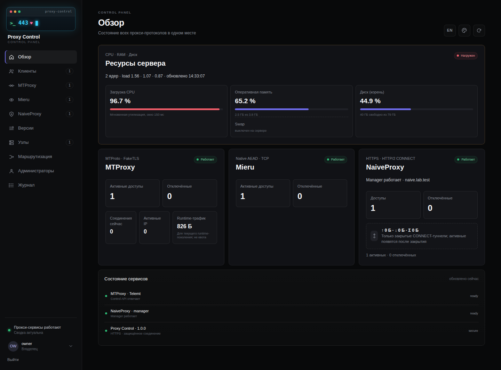
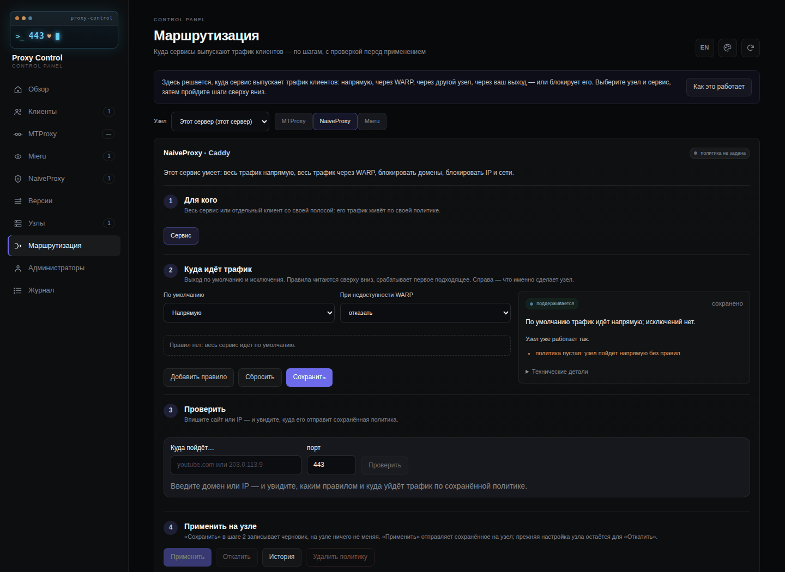

[English](README.en.md) · **Русский**

<div align="center">

# Proxy Control

**Панель управления прокси, которая может работать на одном сервере с 3x-ui**

MTProxy, NaiveProxy и Mieru под одной панелью — с транзакционным установщиком,
который либо доводит установку до конца, либо возвращает сервер в прежнее состояние.

[](https://github.com/dubr1k/proxy-control/actions/workflows/test.yml)
[](LICENSE)

[Что это](#что-это-такое) · [Требования](#требования) · [Установка человеком](#установка-человеком) · [Установка ИИ-агентом](#установка-ии-агентом) · [Обновление](#обновление) · [Документация](#документация)

</div>

<p align="center"></p>

> [!NOTE]
> **Текущий выпуск — [v1.1.1](https://github.com/dubr1k/proxy-control/releases/tag/v1.1.1).**
> Что изменилось — в [описании выпуска](https://github.com/dubr1k/proxy-control/releases/tag/v1.1.1)
> и [журнале изменений](CHANGELOG.ru.md).

> [!IMPORTANT]
> Проект рассчитан на людей, которые понимают, что такое DNS, TLS, Nginx и Docker.
> Установщик берёт на себя рутину и не даст сделать опасный шаг молча, но не заменяет
> понимания того, как устроен ваш сервер.

## Содержание

- [Что это такое](#что-это-такое)
- [Интерфейс](#интерфейс)
- [Как устроен общий порт 443](#как-устроен-общий-порт-443)
- [Требования](#требования)
- [Домены и сертификаты](#домены-и-сертификаты)
- [Установка человеком](#установка-человеком)
- [Установка ИИ-агентом](#установка-ии-агентом)
- [После установки](#после-установки)
- [Обновление](#обновление)
- [Повседневная работа](#повседневная-работа)
- [Возможности подробнее](#возможности-подробнее)
- [Если что-то не работает](#если-что-то-не-работает)
- [Что внутри](#что-внутри)
- [Документация](#документация)
- [Безопасность](#безопасность)
- [Разработка](#разработка)
- [Лицензия и благодарности](#лицензия-и-благодарности)

## Что это такое

Proxy Control — отдельная панель управления прокси MTProxy, NaiveProxy и Mieru, их
пользователями и доступами. Это не дополнение и не ответвление 3x-ui: панель ставится на
чистый сервер или рядом с уже работающим 3x-ui — тогда обе панели делят общий порт 443 и
не мешают друг другу. По желанию установщик поставит и сам 3x-ui.

| Компонент | Что он даёт |
|---|---|
| **MTProxy / Telemt** | Прокси для Telegram: `tg://`-ссылки и QR-коды, лимиты, срок действия, состояние службы. |
| **NaiveProxy** | HTTPS-прокси, который снаружи выглядит обычным сайтом. HTTP/1.1 CONNECT и HTTP/2 CONNECT поверх TLS/TCP, один доступ на оба; квота и учёт трафика на пользователя. |
| **Mieru** | Прокси с маскировкой трафика на собственном протоколе поверх TCP; одноразовая `mierus://`-ссылка и QR. |
| **Рядом с 3x-ui** | Режим `existing` принимает уже установленный 3x-ui: делит с ним порт 443 и не меняет его файлы. Режим `managed-new` на чистом сервере ставит 3x-ui `3.9.0` и создаёт VLESS Reality (TCP и XHTTP) и Hysteria2. Управление 3x-ui остаётся в его собственной панели. |
| **Клиенты и подписки** | Один клиент — доступы ко всем протоколам и одна отзываемая ссылка `https://<домен подписки>/s/<token>` для sing-box/Karing, Clash/mihomo и других. Учётные данные хранятся под мастер-ключом (AES-256-GCM). |
| **Связанные панели (Fleet)** | Центральная панель выдаёт доступы на другие серверы с Proxy Control по HTTPS и API-ключу `node-sync`. |
| **Маршрутизация** | Правила исходящего трафика для каждого узла и службы: напрямую, через WARP, через свой выход или другой узел; блокировки по домену, CIDR, geosite и geoip через необязательный Xray-router. |
| **Обновления** | Экран «Версии» обновляет Telemt, NaiveProxy, Mieru, Xray-router и саму панель с резервной копией и откатом; сервер целиком обновляется одной командой. |
| **MCP и навыки для ИИ** | Необязательный MCP-сервер на центральной панели: API панели как инструменты для Claude Code и Claude Desktop, необратимые действия — только с `confirm`. |
| **Панель** | Роли владельца, администратора и наблюдателя; API-ключи с областями `admin \| monitor \| node-sync`; аудит без секретов; интерфейс на русском и английском. |

Учёт трафика у протоколов разный, и панель этого не скрывает: Telemt разделяет счётчик
процесса и расход квоты, NaiveProxy считает байты только после закрытия туннеля, а Mieru
показывает `unavailable`, когда безопасного счётчика на пользователя нет.

## Интерфейс

Снимки панели с изолированного стенда и тестовыми данными — без ключей, QR-кодов и
адресов рабочих узлов.

| Обзор | Маршрутизация по шагам |
|---|---|
| [](docs/releases/assets/v1.0.0/dashboard.png) | [](docs/releases/assets/v1.0.0/routing.png) |

[Мобильный обзор](docs/releases/assets/v1.0.0/dashboard-phone.png) · [Клиенты с поиском](docs/releases/assets/v1.0.2/clients.png) · [Окно доступа](docs/releases/assets/v1.0.2/grant-window.png) · [Клиенты на телефоне](docs/releases/assets/v1.0.2/clients-phone.png) · [Встроенная инструкция](docs/releases/assets/v1.0.0/routing-guide.png) · [Английский обзор](docs/releases/assets/v1.0.0/dashboard-en.png) · [Маршрутизация на английском](docs/releases/assets/v1.0.0/routing-en.png) · [Вход](docs/releases/assets/v1.0.0/login.png)

## Как устроен общий порт 443

Публичный порт 443 остаётся у Nginx. Nginx смотрит только на имя домена в
TLS-приветствии (SNI) и передаёт соединение нужной службе. Proxy Control не забирает
443 себе: установщик добавляет в карту SNI только свои строки и никогда не переписывает
её целиком. Если конфигурацию Nginx нельзя понять однозначно, он останавливается, а не
угадывает.

```text
Клиент ── TCP/443 ──► Nginx stream + SNI
                         ├──► 3x-ui и его протоколы
                         ├──► MTProxy / Telemt
                         ├──► NaiveProxy
                         ├──► другие ваши сайты
                         └──► панель Proxy Control
```

| Граница | Адрес | Кто имеет доступ |
|---|---|---|
| Публичный вход | TCP/443 | Только Nginx `stream`, маршрутизация по SNI |
| Telemt / MTProxy | `127.0.0.1:8445` | Только Nginx и локальная система |
| Панель | `127.0.0.1:8787` (HTTP) | Локально; наружу — через виртуальный узел HTTPS на `127.0.0.1:8443` |
| NaiveProxy (Caddy) | `127.0.0.1:4443` | Только Nginx |
| Telemt API | `mtproxy:9091` | Только внутри сети Compose |
| Mieru | Выбранные вами TCP-порты | Публично; порт 443 не используется |
| Управление Mieru | `/run/mita/mita.sock` | Только локальный Unix-сокет |
| Вход Fleet v1 | TCP/8790 | Только HTTPS с mTLS, если этот необязательный контур включён |

Свежая установка сохраняет IP клиента панели через общий вход Nginx. Если входящими
соединениями управляет ваша собственная конфигурация Nginx, настройте передачу адреса по
протоколу PROXY — порядок описан в [справочнике установщика](docs/INSTALLER_REFERENCE.ru.md).

Контейнеры называются `proxy-control-*`, проект Compose — `mtproxy`.

## Требования

- Сервер **x86-64** с Ubuntu 24.04 LTS и `systemd`. Другие архитектуры установщик
  отвергает при проверке сервера, до любых изменений.
- Python 3.11 или новее и обычная учётная запись с доступом к `sudo`. Установщик не
  запускают непосредственно от `root`.
- DNS-записи A/AAAA всех ваших имён указывают **напрямую** на сервер. Для MTProto
  проксирование CDN выключено — только режим DNS-only.
- Свободный TCP/80: по нему Let's Encrypt проверяет домены.
- Режим `fresh` — сервер ваш целиком, установщик сам ставит и настраивает Nginx; чужого
  владельца порта 443 быть не должно. Режим `coexist` — уже работающий Nginx со `stream`
  владеет портом 443, и в файле маршрутов есть **ровно одна** понятная карта
  `$ssl_preread_server_name`.
- Свободные локальные порты из таблицы выше.
- Своя резервная копия Nginx, служб, маршрутов и состояния Docker.

Установщик остановится и ничего не тронет, если увидит несовпадение DNS с адресом
сервера, NAT, CDN перед MTProto, неоднозначную карту Nginx, занятый порт, владельца 443,
который не является Nginx, или ошибку `nginx -t`. Это повод сначала разобраться, а не
«продолжить всё равно».

Внешние файлы сторонних компонентов готовить не нужно: установщик сам скачивает их по
закреплённым HTTPS-адресам в `/var/lib/proxy-control/` и сверяет SHA-256 до любого
использования. Для сервера без интернета положите их туда заранее — положенный вручную
файл используется как есть. Список, адреса и контрольные суммы — в
[`release/external-artifacts.json`](release/external-artifacts.json).

## Домены и сертификаты

Именно здесь установка чаще всего останавливается. Полный набор — профиль `full`, 3x-ui в
режиме `managed-new`, домен подписки клиентов и MCP-сервер — требует **11 разных доменов**.
Сертификат нужен не всем:

| Домен | Когда нужен | Сертификат |
|---|---|---|
| `panel` — панель | Всегда | Да |
| `mtproxy` — MTProxy (Fake-TLS) | Всегда | Да |
| `naive` — NaiveProxy | Профили с NaiveProxy | Да |
| `mieru` — Mieru | Профили с Mieru | **Нет** |
| `three_xui.panel_domain` — панель 3x-ui | `managed-new` | Да |
| `three_xui.hysteria_domain` — Hysteria2 | `managed-new` | Да |
| `three_xui.vless_tcp_domain` — VLESS Reality TCP | `existing` и `managed-new` | **Нет** |
| `three_xui.vless_xhttp_domain` — VLESS Reality XHTTP | `existing` и `managed-new` | **Нет** |
| `three_xui.subscription_domain` — подписка 3x-ui | `managed-new`, если нужна | Да |
| `subscription` — подписка клиентов | Если нужны ссылки `https://<домен>/s/<token>` | Да |
| `mcp` — MCP-сервер | Только на центральной панели, если нужен | Да |

Mieru и VLESS Reality не нужен сертификат Let's Encrypt: Mieru работает на собственном
протоколе, Reality использует сертификат сайта-прикрытия. Домен им всё равно нужен — он
попадает в клиентские конфигурации.

Перед выпуском сертификата установщик сам проверяет каждое имя:

1. есть запись A, и хотя бы один её адрес — адрес этого сервера;
2. записи AAAA нет, либо все её адреса тоже принадлежат серверу (забытая AAAA на старый
   сервер — самая частая причина «сертификат выпущен, а протокол не работает»);
3. CAA самого домена и его родителей не запрещает Let's Encrypt;
4. уже существующий сертификат покрывает это имя — чужой сертификат не трогается.

Сертификаты выпускаются `certbot certonly --webroot` по TCP/80 без DNS-01 и API
регистратора. Имена группируются по линиям (`--cert-name`): `proxy-control` — панель и
MTProxy одним сертификатом, `naive`, `three-xui-panel`, `three-xui-hysteria`,
`three-xui-subscription`. Сразу после выпуска выполняется `certbot renew --dry-run`, чтобы
продление было проверено в момент установки, а не через три месяца.

## Установка человеком

### Шаг 1. Скачайте выпуск и проверьте его

Работайте **обычным пользователем с доступом к `sudo`**. Скачивание и проверка проходят
без прав администратора:

```bash
curl -fsSLO https://github.com/dubr1k/proxy-control/releases/latest/download/install-release.sh &&
curl -fsSLO https://github.com/dubr1k/proxy-control/releases/latest/download/install-release.sh.sha256 &&
sha256sum --check install-release.sh.sha256
```

Если контрольная сумма совпала, прочитайте сценарий и требования, затем запустите мастер:

```bash
less install-release.sh
bash install-release.sh --requirements
bash install-release.sh
```

Сценарий скачивает архив, `SHA256SUMS`, `release-manifest.json` и `sbom.spdx.json`,
сверяет контрольные суммы, описание выпуска и SHA-256 архива, записанную в самом сценарии:
подменённый архив не распаковывается, даже если вместе с ним подменён `SHA256SUMS`. При
наличии `gh` дополнительно проверяется attestation — подтверждение происхождения файлов.
Происхождение самого сценария проверяется командой
`gh attestation verify install-release.sh --repo dubr1k/proxy-control`.

Полезные параметры: `--check-only` только скачивает и проверяет; `--no-wizard` ещё и
распаковывает, но мастер не запускает; `--lang ru|en` — язык сообщений. Для установки
именно 1.1.1 замените в обеих ссылках `releases/latest/download/` на
`releases/download/v1.1.1/`.

Проект намеренно не предлагает «скачать и сразу выполнить одной командой»: сценарий
сначала проверяется, потом читается и только потом запускается.

### Шаг 2. Ответьте на вопросы мастера

Мастер говорит по-русски или по-английски, перед каждым выбором коротко объясняет варианты
и сохраняет ответы в файл TOML, который можно прочитать и поправить вручную. В квадратных
скобках — ответ по умолчанию, клавиша ввода его принимает.

**Режим сервера.** `fresh` (по умолчанию) — установщик сам ставит и настраивает Nginx.
`coexist` — Nginx уже держит порт 443, установщик только дописывает свои маршруты.

**Профиль.**

| Профиль | Что ставится |
|---|---|
| `core` | Telemt/MTProxy и панель |
| `core-naive` | То же плюс NaiveProxy |
| `core-mieru` | То же плюс Mieru |
| `full` | Всё вместе (по умолчанию) |

**Режим 3x-ui.**

- `none` — 3x-ui не трогаем совсем (по умолчанию);
- `existing` — принять уже установленный: установщик добавит маршруты к его входящим
  подключениям VLESS Reality TCP и XHTTP и не изменит ни одного его файла. Входящие
  подключения вы заводите в 3x-ui сами;
- `managed-new` — поставить 3x-ui `3.9.0`: установщик выпишет сертификаты, уведёт панель
  3x-ui с публичных портов на `127.0.0.1` под приватный адрес, сменит заводские
  `admin/admin` на ваши и сам создаст VLESS Reality TCP, VLESS Reality XHTTP и Hysteria2.
  Только в режиме `fresh`.

**Домены.** Мастер спрашивает только те, что нужны выбранному профилю и режиму 3x-ui (см.
[таблицу доменов](#домены-и-сертификаты)). Домен подписки клиентов и домен MCP-сервера можно
оставить пустыми — тогда эти функции выключены. MCP нужен только на центральной панели.
Порты Mieru по умолчанию — `46001`; мастер не даст выбрать порт, занятый самим
установщиком, и скажет, кем он занят.

**WARP.** В режиме `managed-new` мастер спрашивает, включать ли WARP для Xray, и при ответе
«да» требует непустой список доменов и `geosite:`-списков через запятую (например,
`example.com, geosite:openai`); NaiveProxy и Mieru при этом остаются на прямом выходе.
В режимах 3x-ui `none` и `existing` вопрос задаётся, если профиль включает NaiveProxy или
Mieru: ответ «да» направляет весь их трафик через WARP. Установщик сам ставит закреплённый
официальный клиент Cloudflare и поднимает собственную точку SOCKS5 `127.0.0.1:40000`;
заранее запущенный WARP не нужен и считается чужим состоянием.

**Почта для сертификатов.** Адрес для Let's Encrypt.

**Учётные данные.** Имя первого пользователя MTProxy и Mieru; пароль владельца панели
(имя для входа всегда `owner`); имя и пароль панели 3x-ui в режиме `managed-new`. Пароль
вводится дважды и не отображается. **Пустой ответ означает «создай сам»** — установщик
сгенерирует случайный пароль. Требование одно: не короче 12 символов.

> [!IMPORTANT]
> Пароли не попадают в файл конфигурации. Если вы выбираете «сохранить» (`save`), мастер
> кладёт их рядом, в `<имя-конфигурации>.credentials` с правами `0600`, — **удалите этот
> файл сразу после установки**. При выборе «применить» (`apply`) пароли передаются
> установке напрямую и стираются, как только она закончится.

**Порты в UFW.** Только в режиме `fresh`: разрешить ли установщику открыть нужные порты
(по умолчанию да). Он добавляет только свои правила с пометкой `proxy-control:firewall`, а
выключенный UFW включает, первым правилом пропустив SSH.

В конце мастер показывает все ответы и предлагает исправить любое поле, сохранить
конфигурацию или продолжить. Готовые конфигурации для каждого профиля и режима 3x-ui —
в [`examples/installer/`](examples/installer).

### Шаг 3. Проверьте план и подтвердите его

План — полный список того, что произойдёт: пакеты, файлы, маршруты Nginx, сертификаты,
службы. Секретов в нём нет. План ничего не меняет, поэтому его можно запускать заранее,
чтобы проверить домены и DNS:

```bash installer-check
sudo python3 -m installer.cli plan --config examples/installer/full-three-xui.toml --json
```

Установка начинается только после подтверждения контрольной суммы (digest) именно этого
плана. Если сервер изменился между планом и установкой, сумма не совпадёт и установка не
пойдёт:

```bash installer-check
sudo python3 -m installer.cli install --config examples/installer/full-three-xui.toml --accept-plan DIGEST
```

Мастер делает то же самое сам: показывает план и просит ввести первые 12 символов digest.

### Шаг 4. Дождитесь приёмки

Установщик не считает работу сделанной по факту «контейнер запустился» — он проверяет
каждый протокол настоящим клиентом:

- **MTProxy** — Fake-TLS, Obfuscated2, `req_pq_multi` и проверенный ответ `resPQ`;
- **NaiveProxy** — сайт-прикрытие без пароля, затем аутентифицированный `CONNECT`,
  известная нагрузка и запись в учёте;
- **Mieru** — статус `RUNNING` и официальный клиент, который реально выходит в интернет;
- **панель** — вход, роли, создание и отзыв временного доступа;
- **соседние маршруты** — каждый чужой SNI продолжает работать.

Если любая проверка не прошла, установщик откатывает сделанное и возвращает сервер в
прежнее состояние.

### Ручная установка из архива

Тот же путь без сценария. Скачайте четыре файла из раздела Assets
[выпуска 1.1.1](https://github.com/dubr1k/proxy-control/releases/tag/v1.1.1): архив,
`SHA256SUMS`, `release-manifest.json` и `sbom.spdx.json`. `SHA256SUMS` проверяет три файла:
архив, описание выпуска и перечень компонентов `sbom.spdx.json`; сам файл контрольных сумм
берётся со страницы выпуска и отдельного подтверждения происхождения не имеет.

```bash installer-check
sha256sum --check SHA256SUMS &&
tar -xOf proxy-control-v1.1.1.tar.gz proxy-control/install-bootstrap > install-bootstrap &&
chmod 700 install-bootstrap &&
./install-bootstrap --archive proxy-control-v1.1.1.tar.gz --checksum SHA256SUMS --manifest release-manifest.json
```

`install-bootstrap` отказывается работать от `root`. Перед единственным вызовом `sudo` он
проверяет владельца и права файлов, контрольную сумму архива, соответствие описанию
выпуска, отсутствие признака предварительной версии и путей, выходящих за пределы архива.
Из рабочей копии Git установщик не запускается: ему нужен `release/release.json`, который
создаётся при сборке выпуска.

Если Nginx, сертификаты и окружение вы ведёте сами, базовый контур можно поднять
напрямую через Compose: [DOCKER_DEPLOYMENT.ru.md](DOCKER_DEPLOYMENT.ru.md); ручная
установка NaiveProxy и Mieru — в [PANEL.ru.md](PANEL.ru.md) и [MIERU.ru.md](MIERU.ru.md).

## Установка ИИ-агентом

Этот раздел — инструкция для ИИ-агента (Claude Code, Codex и подобных), которому вы дали
SSH-доступ к серверу. Агент ставит Proxy Control **без мастера**: пишет конфигурацию TOML,
получает план и устанавливает ровно его после вашего подтверждения.

### Что сказать агенту

Скопируйте и заполните:

```text
Установи Proxy Control на этот сервер по разделу «Установка ИИ-агентом»
из https://github.com/dubr1k/proxy-control (README.md). Соблюдай правила раздела.
Режим сервера: fresh. Профиль: full. 3x-ui: none.
Домены: панель panel.example.com, MTProxy relay.example.com,
NaiveProxy edge.example.com, Mieru mieru.example.com,
подписка клиентов sub.example.com.
Почта для Let's Encrypt: admin@example.com.
WARP: нет.
Пароли не придумывай и не показывай — пусть их создаст установщик.
Перед установкой покажи мне план и дождись моего подтверждения.
```

### Правила для агента

1. **Только названный сервер.** Не трогать соседние сайты, контейнеры, маршруты Nginx и
   другие серверы. Работать обычным пользователем с `sudo`; от `root` сценарий установки
   не запускается.
2. **Ни одного секрета в выводе.** Не выбирать, не печатать и не сохранять пароли, ключи
   доступа, ссылки доступа и QR. Пароли создаёт установщик (пустые значения), либо
   владелец сам кладёт их в `<конфигурация>.credentials` с правами `0600`. В отчёте —
   только пути к файлам с учётными данными, не их содержимое.
3. **Отказ проверки — это стоп.** Если `plan` завершился с ненулевым кодом (DNS, CAA, занятый
   порт, NAT, CDN, чужой владелец 443, неоднозначный Nginx), не обходить проверку и не
   менять сервер «чтобы прошло»: остановиться и передать владельцу причину дословно.
4. **Ставить только подтверждённый план.** Digest берётся из JSON-вывода `plan`, не
   переписывается вручную и подтверждается владельцем.
5. **Не повторять установку вслепую.** При обрыве — `status`, затем `resume` или `repair`.
   Не удалять файлы журнала и состояния в `/var/lib/proxy-control/`.

### Шаг 1. Скачать и проверить выпуск

```bash
curl -fsSLO https://github.com/dubr1k/proxy-control/releases/latest/download/install-release.sh
curl -fsSLO https://github.com/dubr1k/proxy-control/releases/latest/download/install-release.sh.sha256
sha256sum --check install-release.sh.sha256      # ожидается: install-release.sh: OK
bash install-release.sh --requirements           # что нужно серверу и что будет поставлено
bash install-release.sh --no-wizard              # скачать, проверить и распаковать без мастера
cd proxy-control-v*/proxy-control
```

Любая ошибка проверки контрольной суммы или выпуска — стоп и отчёт владельцу.

### Шаг 2. Написать конфигурацию

Возьмите ближайший пример из `examples/installer/` и замените значения на данные владельца:

| Пример | Режим сервера | 3x-ui |
|---|---|---|
| `core.toml`, `core-naive.toml`, `core-mieru.toml` | `fresh` | `none` |
| `managed-three-xui.toml` | `fresh` | `managed-new` |
| `existing-three-xui.toml`, `full-three-xui.toml` | `coexist` | `existing` |

```bash
cp examples/installer/core.toml ~/proxy-control.toml
chmod 600 ~/proxy-control.toml
# отредактировать: host_mode, profile, acme_email, [domains], [mieru], [three_xui], [firewall]
```

Необязательные части: `domains.subscription` (подписки клиентов), `domains.mcp` (MCP-сервер,
только на центральной панели), секция `[egress]` (WARP и Xray-router). Каждое поле описано в
[справочнике установщика](docs/INSTALLER_REFERENCE.ru.md). Пароли в TOML не пишутся.

### Шаг 3. Получить план и показать его владельцу

```bash
sudo python3 -m installer.cli plan --config ~/proxy-control.toml --json > ~/plan.json
echo "exit=$?"                                   # не 0 — стоп, причина владельцу
python3 -c 'import json,sys; print(json.load(open(sys.argv[1]))["digest"])' ~/plan.json
sudo python3 -m installer.cli plan --config ~/proxy-control.toml   # читаемый план для владельца
```

Покажите владельцу читаемый план и digest и дождитесь явного подтверждения.

### Шаг 4. Установить ровно этот план

```bash
digest=$(python3 -c 'import json,sys; print(json.load(open(sys.argv[1]))["digest"])' ~/plan.json)
sudo python3 -m installer.cli install --config ~/proxy-control.toml --accept-plan "$digest" --json > ~/install.json
sudo python3 -m installer.cli status --json      # ожидается "status": "active"
```

Установка идёт несколько минут и сама проводит приёмку протоколов. При обрыве SSH код `255`
говорит только о потере связи: сначала `status`, затем `resume` или `repair`.

### Шаг 5. Проверить и отчитаться

```bash
cd /opt/mtproxy-shared443 && sudo docker compose ps
curl -fsS -H 'Host: panel.example.com' http://127.0.0.1:8787/healthz   # {"status":"ok"}
sudo nginx -t
systemctl is-active nginx docker
```

В отчёте владельцу: домены, профиль, digest плана, версия из файла `VERSION`, состояние
контейнеров и служб, **пути** к учётным данным (`/opt/mtproxy-shared443/secrets/panel-bootstrap-password`,
для `managed-new` — `/var/lib/proxy-control/three-xui/panel-access`) и что осталось проверить
человеку: вход в панель и подключение настоящим клиентом. Если владелец сохранял
`<конфигурация>.credentials`, напомните удалить этот файл.

После установки агент работает с панелью не через SSH, а через [MCP-сервер](docs/MCP.ru.md):
выдача доступов, маршрутизация, обновления и диагностика описаны в [навыках](skills/) для
типовых задач.

## После установки

**Панель Proxy Control.** Откройте `https://<домен панели>/login` и войдите как `owner`.
Если пароль оставляли пустым, установщик положил его в
`/opt/mtproxy-shared443/secrets/panel-bootstrap-password` (`0600`): прочитайте через
защищённую консоль, войдите и сразу смените.

**Панель 3x-ui** (`managed-new`). Слушает `127.0.0.1:8451` под приватным адресом и доступна
снаружи по своему домену через общий 443. Адрес, имя и пароль:

```bash
sudo cat /var/lib/proxy-control/three-xui/panel-access
```

**MCP-сервер** (если задан `domains.mcp`). Адрес `https://<домен mcp>/mcp` и ключ доступа
записаны в `credentials/handoff.json` рядом с отчётом установки (`0600`, только `root`).
Подключение к Claude Code — в [docs/MCP.ru.md](docs/MCP.ru.md).

Не копируйте эти файлы в Git, сообщения об ошибках, журналы и общие резервные копии.
Файл `<имя-конфигурации>.credentials`, если мастер его создавал, удалите.

**Роли.** Владелец (`owner`) — администраторы, API-ключи, клиенты, связанные панели;
администратор (`admin`) — пользователи протоколов и аудит; наблюдатель (`viewer`) — только
просмотр. Последнего владельца нельзя удалить или понизить; каждое изменение требует CSRF и
попадает в аудит без паролей, ключей, ссылок и QR.

## Обновление

Перед обновлением сделайте [резервную копию](docs/BACKUP_RESTORE.ru.md). В парке связанных
панелей сначала обновите узлы, затем центральную панель. Сервер обновляется тем же
сценарием, что ставит новый, — режимом `--update`, обычным пользователем с `sudo`:

```bash
curl -fsSLO https://github.com/dubr1k/proxy-control/releases/latest/download/install-release.sh &&
curl -fsSLO https://github.com/dubr1k/proxy-control/releases/latest/download/install-release.sh.sha256 &&
sha256sum --check install-release.sh.sha256 &&
bash install-release.sh --update
```

Сценарий проверяет выпуск так же, как при установке, и просит `version-agent` сервера
обновить панель ровно до проверенного архива — с резервной копией файлов, образа и базы и
откатом при неудаче; затем пересобирает изменившиеся службы управления. Telemt,
сертификаты, `.env` и `secrets/` не трогаются.

Отдельные компоненты — **Telemt**, **NaiveProxy/Caddy**, **Mieru/mita**, **Xray-router** и
саму панель — можно обновить с экрана «Версии». Кнопка «Проверить обновления» показывает
новые выпуски этих проектов с их опубликованной контрольной суммой; выпуск без контрольной
суммы виден, но не ставится. Контрольная сумма обнаруживает подмену относительно
опубликованного значения, но сама по себе не подтверждает автора и не означает, что версия
проверена в Proxy Control. Обновление доступно только владельцу, и при ошибке агент
возвращает предыдущую версию. Уже установленный 3x-ui обновляется его собственными
средствами.

Полный порядок и откат — в [docs/UPGRADING.ru.md](docs/UPGRADING.ru.md).

## Повседневная работа

### Проверка состояния

```bash
cd /opt/mtproxy-shared443
docker compose ps
curl -fsS -H 'Host: panel.example.com' http://127.0.0.1:8787/healthz
sudo nginx -t
ss -lntup
systemctl is-active nginx docker
systemctl is-active caddy-naive mita
```

Заголовок `Host` обязателен: панель принимает только своё публичное имя. Ожидается
`{"status":"ok"}`. Перед тем как показывать вывод, уберите пароли, URL доступа, QR, ключи и
сертификаты.

### Резервная копия

Главное — база панели и **мастер-ключ** `secrets/panel-master-key`, который хранится
отдельно от базы: без него зашифрованные учётные данные не восстановить. Копия базы без
остановки службы:

```bash
docker exec -i proxy-control-panel python - <<'PY'
import sqlite3
src = sqlite3.connect('/data/panel.sqlite3')
dst = sqlite3.connect('/data/panel.backup.sqlite3')
with dst:
    src.backup(dst)
print(dst.execute('PRAGMA integrity_check').fetchone()[0])
dst.close(); src.close()
PY
```

Ожидается ровно `ok`. Что ещё резервировать для Telemt, NaiveProxy, Mieru, Nginx и Fleet и как
восстанавливать — в [docs/BACKUP_RESTORE.ru.md](docs/BACKUP_RESTORE.ru.md).

### Если установка прервалась

```bash installer-check
sudo python3 -m installer.cli status --json
sudo python3 -m installer.cli resume --json
sudo python3 -m installer.cli repair --json
```

`resume` продолжает прерванную установку с сохранённой фазы. `repair` проверяет, что всё
принадлежащее установщику на месте и не изменено, и перезапускает только свои службы. Не
удаляйте `journal.json`, `journal.key`, `transaction.json`, файлы WAL/SHM и резервные копии,
чтобы «починить» запуск.

### Удаление

```bash installer-check
sudo python3 -m installer.cli uninstall --json
```

Удаление останавливает службы и убирает только принадлежащие установщику маршруты, файлы и
пакеты; секреты, тома и каталоги сайтов-прикрытий без `--purge-data` остаются. После удаления
проверьте `nginx -t`, публичные слушатели и соседние SNI.

> [!WARNING]
> Пакеты, которые поставил сам установщик, удаляются полностью (`apt-get purge`) — с
> `--purge-data` и без него. Если на чистом сервере это были `docker.io` и `certbot`, вместе с
> ними пропадают `/var/lib/docker` — все тома, включая базу панели, — и `/etc/letsencrypt` с
> сертификатами. Перед удалением сделайте [резервную копию](docs/BACKUP_RESTORE.ru.md) и унесите
> её с сервера.

## Возможности подробнее

### Клиенты, доступы и подписки

Экран «Клиенты» держит человека и все его доступы к MTProxy, NaiveProxy и Mieru вместе:
поиск и фильтры по всему списку, импорт существующих пользователей служб только чтением,
выдача доступа одной журналируемой операцией с честным исходом — `succeeded`,
`compensated` или `manual_intervention_required`. Каждому клиенту — одна ссылка
`https://<домен подписки>/s/<token>` на все его доступы в форматах `raw`, `singbox`
(Karing и sing-box), `clash` (mihomo), `manifest` и `html`. Ключ ссылки показывается один раз,
в базе хранится только его контрольная сумма, отзыв действует мгновенно, запросы подписки
не пишутся в журналы. Подробно — [PANEL.ru.md](PANEL.ru.md).

### Протоколы

- **MTProxy / Telemt.** Источник истины после первого запуска — том `telemt-config`; квота и
  счётчик процесса — разные величины. [DOCKER_DEPLOYMENT.ru.md](DOCKER_DEPLOYMENT.ru.md)
- **NaiveProxy.** Без пароля домен показывает страницу-прикрытие, а не «407». Один URL
  `https://<user>:<pass>@<домен>` работает и как HTTPS, и как HTTP/2. Через прокси идёт только
  TCP; HTTP/3 наружу не публикуется. Проверенные клиенты — `naive`, Karing и sing-box.
  [PANEL.ru.md](PANEL.ru.md)
- **Mieru.** Свои TCP-порты, порт 443 не занимает. Проект проверяет и обещает только TCP:
  UDP-профили в реальных сетях у клиентов не работают. Квота — приблизительная проверка, не
  платёжный счётчик. [MIERU.ru.md](MIERU.ru.md), [выдача доступов](docs/MIERU_SHARING.ru.md)
- **3x-ui.** Остаётся отдельной панелью со своим интерфейсом; Proxy Control следит, чтобы оба
  жили на одном 443. В `managed-new` входящие подключения слушают `127.0.0.1:8449` (VLESS
  Reality TCP), `127.0.0.1:8450` (XHTTP) и `0.0.0.0:443/UDP` (Hysteria2); подписка 3x-ui
  публикуется только при заданном `subscription_domain`.

### Связанные панели (Fleet)

Одна панель становится центральной и управляет другими по их собственным HTTPS-доменам:
на узле владелец создаёт API-ключ `node-sync`, на центре «Узлы → + Панель» принимает URL и
ключ, затем «Импортировать» забирает существующих пользователей. На серверах не появляется
ничего, кроме образа панели. Доверие — WebPKI или закреплённый отпечаток сертификата;
желаемое состояние узла — нумерованные поколения с контрольной суммой; узел без связи
догоняет при возвращении. Подробно — [FLEET.ru.md](FLEET.ru.md).

### Маршрутизация и WARP

Для каждого узла и службы задаётся политика исходящего трафика: весь трафик напрямую или
через WARP, свой выход, другой узел парка (цепь до трёх узлов), блокировки по домену и CIDR.
Необязательный **Xray-router** на узле добавляет geosite, geoip и порты; через него
маршрутизируется и MTProxy. Предпросмотр показывает ровно то, что применит служба узла;
применение транзакционно с откатом — локально и на связанных панелях.

WARP — одна локальная точка **SOCKS5** на `127.0.0.1:40000`. Установщик ставит закреплённый
официальный клиент Cloudflare, проверяет SHA-256 и принимает WARP только после реального
HTTPS-запроса через SOCKS5 с внешним IP, отличным от прямого выхода. Клиент WARP —
проприетарная внешняя зависимость, он не входит в MIT-лицензию проекта и в архив выпуска.

| Протокол | Что уходит через WARP |
|---|---|
| **Xray / управляемый 3x-ui** | Домены из `warp_domains`. Маршрутизация принятого 3x-ui (`existing`) не меняется. |
| **NaiveProxy** | Начальное значение `[egress].naive`; дальше решает политика маршрутизации панели. |
| **Mieru** | Начальное значение `[egress].mieru`; дальше решает политика маршрутизации, включая выборочные правила. |

Подробно — [docs/ROUTING.ru.md](docs/ROUTING.ru.md) и [docs/XRAY_ROUTER.ru.md](docs/XRAY_ROUTER.ru.md).

### MCP-сервер и навыки для ИИ

Контейнер `proxy-control-mcp` на центральной панели открывает API панели как инструменты
Model Context Protocol по `https://<домен mcp>/mcp`. Каждый вызов идёт через API-ключ `mcp`
и виден в аудите; необратимые действия требуют `confirm: true`. В [`skills/`](skills/) лежат
готовые инструкции для ИИ по типовым задачам: утренний обзор, выдача доступа, диагностика,
маршрутизация, обновления. Подключение — [docs/MCP.ru.md](docs/MCP.ru.md).

### Пока не поддерживается

Управление доступами 3x-ui из Proxy Control, постепенное применение правил к части узлов,
UDP через Xray-router, история показателей и обновление панели узла из центра. Для клиентов
Mieru заявлен только TCP. Учёт трафика не предназначен для расчёта платежей.

## Если что-то не работает

- **Панель не открывается.** Проверьте `127.0.0.1:8787`, `PANEL_ALLOWED_HOSTS`, виртуальный
  узел HTTPS на `8443`, базу SQLite и владельца тома.
- **MTProxy запущен, но клиент не подключается.** Проверьте A/AAAA, отсутствие CDN, карту
  SNI, имя Fake-TLS и настоящий ответ `resPQ` — открытый порт ничего не доказывает.
- **Учёт NaiveProxy не растёт.** Запись появляется только после закрытого `CONNECT`.
- **Служба управления Mieru не отвечает.** Проверьте версию `mita`, `/run/mita/mita.sock` и
  GID сокета. Не применяйте рекурсивный `chown` вслепую.
- **Нет QR старого пользователя Mieru.** «Конфигурация» показывает сохранённый ключ; если
  ключ не сохранён, один раз нажмите «Новый ключ».

Больше случаев — [устранение проблем](docs/TROUBLESHOOTING.ru.md) и
[руководство по эксплуатации](docs/OPERATIONS.ru.md).

## Что внутри

### Пакеты сервера

Адаптер `packages` ставит ровно эти пакеты: `ca-certificates`, `certbot`, `curl`,
`docker-compose-v2`, `docker.io`, `nginx-full`, `openssl`, `python3`.

### Закреплённые версии сторонних компонентов

Установщик скачивает их по закреплённым HTTPS-адресам и отказывается продолжать, если
контрольная сумма не совпала.

| Компонент | Версия | Лицензия | Назначение |
|---|---|---|---|
| `mita` (`enfein/mieru`) | 3.36.0 | GPL-3.0-or-later | Сервер Mieru; ставится только исполняемый файл и уведомление о лицензии. |
| `mieru` (`enfein/mieru`) | 3.36.0 | GPL-3.0-or-later | Официальный клиент Mieru для приёмки трафика. |
| `three_xui` (`MHSanaei/3x-ui`) | 3.9.0 | GPL-3.0-only | Панель 3x-ui и её Xray для VLESS Reality и Hysteria2 в режиме `managed-new`. |
| `xray` (`XTLS/Xray-core`) | 26.3.27 | MPL-2.0 | Xray-router: из `Xray-linux-64.zip` берутся только `xray`, `geoip.dat` и `geosite.dat`, каждый по своей контрольной сумме. |

Caddy `v2.11.4` с модулем `http.handlers.forward_proxy` собирается по
`docker/Dockerfile.caddy-naive`. Адреса, контрольные суммы и идентификаторы SPDX — в
[`release/external-artifacts.json`](release/external-artifacts.json), который сборка
выпуска встраивает в SBOM.

### Образы контейнеров

| Dockerfile | Образ | База |
|---|---|---|
| `panel/Dockerfile` | API и интерфейс панели | `python:3.13.5-slim` |
| `naive_manager/Dockerfile` | Управление доступами и учёт NaiveProxy | `python:3.13.5-slim` |
| `mieru_manager/Dockerfile` | Управление доступами и квотами Mieru | `python:3.13.5-slim` |
| `xray_router_manager/Dockerfile` | Xray-router и его служба управления | `python:3.13.5-slim` |
| `mcp_server/Dockerfile` | MCP-сервер (только центральная панель) | `python:3.13.5-slim` |
| `deploy/Dockerfile.agent` | Агент узла Fleet v1 | `python:3.13.5-slim` |
| `deploy/Dockerfile.ingress` | Вход Fleet v1 с mTLS | `python:3.13.5-slim` |
| `deploy/mieru-client/Dockerfile` | Клиент Mieru для приёмки | `python:3.13.5-slim` |
| `probe/Dockerfile` | Проба MTProto на TDLib | `node` |
| `docker/Dockerfile.caddy-naive` | Caddy с `forward_proxy` | `caddy:2.11.4-builder` → `scratch` |
| `scripts/lab/Dockerfile.acceptance` | Одноразовый systemd-контейнер стенда | `ubuntu` |

Каждая база закреплена по контрольной сумме.

### Зависимости Python

Панель (`panel/requirements.txt`): `fastapi`, `starlette`, `annotated-doc`,
`opentelemetry-api`, `pydantic`, `pydantic_core`, `annotated-types`, `typing-inspection`,
`typing_extensions`, `httpx`, `httpcore`, `h11`, `certifi`, `idna`, `anyio`, `Jinja2`,
`MarkupSafe`, `argon2-cffi`, `argon2-cffi-bindings`, `cryptography`, `cffi`, `pycparser`,
`uvicorn`, `click`, `qrcode`.

MCP-сервер (`mcp_server/requirements.txt`): `mcp`, `mcp-types`, `starlette`, `sse-starlette`,
`uvicorn`, `httpx`, `httpx2`, `httpcore`, `httpcore2`, `h11`, `anyio`, `pydantic`,
`pydantic_core`, `annotated-types`, `typing-inspection`, `typing_extensions`, `jsonschema`,
`jsonschema-specifications`, `referencing`, `rpds-py`, `attrs`, `PyJWT`, `cryptography`,
`cffi`, `pycparser`, `python-multipart`, `opentelemetry-api`, `truststore`, `certifi`,
`idna`, `click`.

Разработка (`panel/requirements-dev.txt`): `pytest`, `pytest-anyio`, `iniconfig`,
`packaging`, `pluggy`, `Pygments`, `ruff` и зависимости MCP-сервера.

Все версии закреплены точно. Установщик и службы управления NaiveProxy и Mieru используют
только стандартную библиотеку Python.

## Документация

| Тема | Документ |
|---|---|
| Карта всей документации | [docs/README.md](docs/README.md) |
| Установка на Ubuntu 24.04 | [INSTALL.ru.md](INSTALL.ru.md) |
| Все команды и поля установщика | [docs/INSTALLER_REFERENCE.ru.md](docs/INSTALLER_REFERENCE.ru.md) |
| Панель, роли, API-ключи, NaiveProxy | [PANEL.ru.md](PANEL.ru.md) |
| MTProto за Nginx | [DOCKER_DEPLOYMENT.ru.md](DOCKER_DEPLOYMENT.ru.md) |
| Mieru | [MIERU.ru.md](MIERU.ru.md), [выдача доступов](docs/MIERU_SHARING.ru.md) |
| Связанные панели | [FLEET.ru.md](FLEET.ru.md) |
| Маршрутизация и Xray-router | [docs/ROUTING.ru.md](docs/ROUTING.ru.md), [docs/XRAY_ROUTER.ru.md](docs/XRAY_ROUTER.ru.md) |
| MCP-сервер | [docs/MCP.ru.md](docs/MCP.ru.md) |
| Эксплуатация | [docs/OPERATIONS.ru.md](docs/OPERATIONS.ru.md) |
| Резервное копирование | [docs/BACKUP_RESTORE.ru.md](docs/BACKUP_RESTORE.ru.md) |
| Обновление и откат | [docs/UPGRADING.ru.md](docs/UPGRADING.ru.md) |
| Устранение проблем | [docs/TROUBLESHOOTING.ru.md](docs/TROUBLESHOOTING.ru.md) |
| Протокол разработки для ИИ-агентов | [AGENTS.md](AGENTS.md) |
| Журнал изменений | [CHANGELOG.ru.md](CHANGELOG.ru.md) |

## Безопасность

- Не публикуйте `.env`, `secrets/`, URL доступа, QR, ключи доступа, базы, журналы и ключи PKI.
- Не открывайте наружу Telemt API, управляющие Unix-сокеты и Caddy Admin API.
- Не подключайте сокет Docker к службам проекта.
- Не меняйте закреплённые Telemt, Caddy или `mita` без проверки происхождения, контрольных
  сумм и плана отката.
- Перед боевым развёртыванием прочитайте [SECURITY.md](SECURITY.md) и
  [политику совместимости](docs/COMPATIBILITY.md).

## Разработка

```bash
python3 -m venv .venv
.venv/bin/python -m pip install -r panel/requirements-dev.txt
.venv/bin/ruff check .
.venv/bin/python -m pytest -q
python3 scripts/check-doc-links.py
git ls-files -z '*.sh' | xargs -0 -r -n1 bash -n
git ls-files -z '*.sh' | xargs -0 -r shellcheck
git diff --check
```

Установщик проверяется на архиве выпуска в двух стендах — [tests/lab/README.md](tests/lab/README.md).
Правила участия — [CONTRIBUTING.md](CONTRIBUTING.md), рабочий протокол для ИИ-агентов —
[AGENTS.md](AGENTS.md).

## Лицензия и благодарности

Код распространяется по [лицензии MIT](LICENSE). Сторонние компоненты сохраняют собственные
лицензии — их перечень, сведения о происхождении и уведомления об авторских правах в
[THIRD_PARTY_NOTICES.md](THIRD_PARTY_NOTICES.md).

Proxy Control опирается на работу авторов и сопровождающих этих проектов:

| Компонент | За что благодарим | Ссылка |
|---|---|---|
| Telemt | Служба MTProto/MTProxy на Rust | [telemt/telemt](https://github.com/telemt/telemt) |
| Mieru и mita | Прокси и средства управления | [enfein/mieru](https://github.com/enfein/mieru) |
| 3x-ui | Панель управления Xray | [MHSanaei/3x-ui](https://github.com/MHSanaei/3x-ui) |
| Xray-core | Маршрутизатор исходящего трафика | [XTLS/Xray-core](https://github.com/XTLS/Xray-core) |
| Caddy | Обратный прокси HTTPS и управление TLS | [caddyserver/caddy](https://github.com/caddyserver/caddy) |
| forwardproxy | Модуль HTTP CONNECT для Caddy | [klzgrad/forwardproxy](https://github.com/klzgrad/forwardproxy) |
| Nginx | Маршрутизация по SNI на общем порту 443 | [nginx.org](https://nginx.org/) |
| Certbot и Let's Encrypt | Выпуск и продление сертификатов | [Certbot](https://github.com/certbot/certbot) · [Let's Encrypt](https://letsencrypt.org/) |
| Docker и Compose | Изолированное выполнение служб | [Docker](https://www.docker.com/) · [Compose](https://github.com/docker/compose) |
| Библиотеки Python | FastAPI, Starlette, Pydantic, HTTPX, Uvicorn, Argon2, cryptography, qrcode | [зависимости](panel/requirements.txt) |

Спасибо всем разработчикам, сопровождающим и участникам этих проектов.
