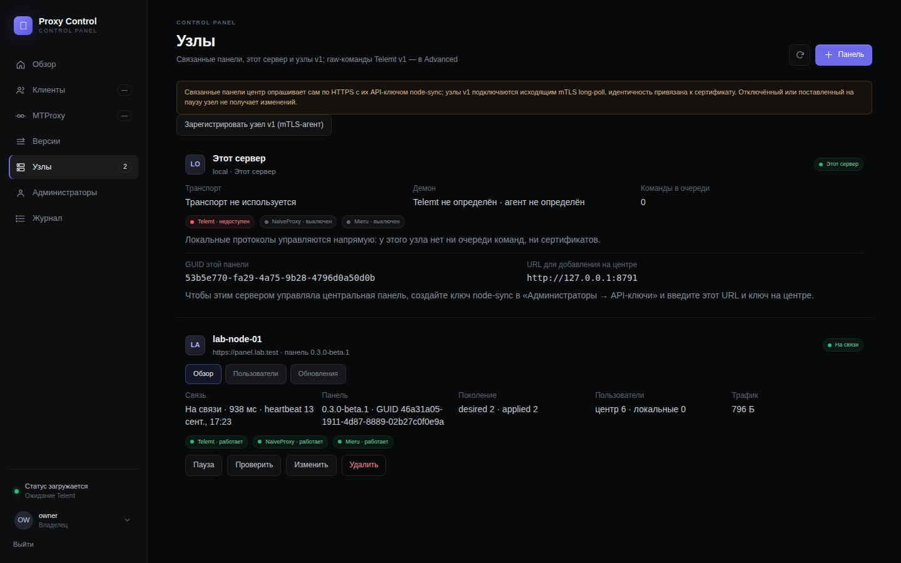
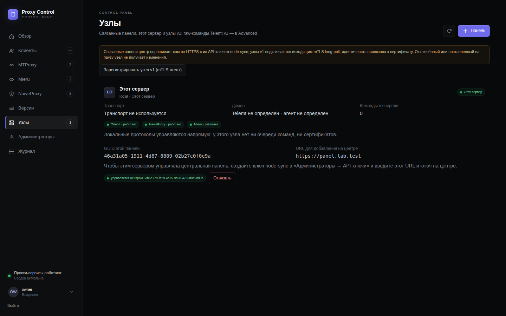
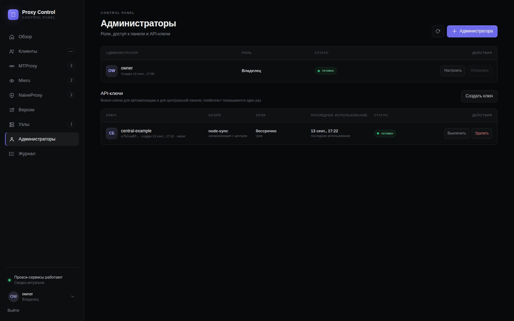

# Proxy Control v0.3.0-beta.1

> **Статус / Status:** Beta — гейт v0.3 пройден на стенде 2026-09-14 (дерево `ade7fcc`, после трёх раундов фикс-волны финального ревью). Центральная панель управляет связанными панелями по HTTPS с scoped API-ключами; ничего, кроме образа панели, на хостах не появляется. Гейт — только стенд `ams-test`; CI подтверждает байты и публикует. / Beta — the v0.3 gate passed on the lab host on 2026-09-14 (tree `ade7fcc`, after the three rounds of the final-review fix wave). A central panel manages linked panels over HTTPS with scoped API keys; nothing beyond the panel image appears on a host. The gate is the lab host only; CI confirms the bytes and publishes.

## Русский

### Что нового

- **API-ключи.** «Администраторы → API-ключи»: имя, scope `admin | monitor | node-sync`, срок; в базе только SHA-256, плейнтекст `pc_<prefix>_<secret>` показывается один раз; включение/выключение/удаление действуют немедленно; `Authorization: Bearer` принимается на всём `/api/*`, лимит 120 запросов в минуту на ключ. `PANEL.ru.md`.
- **Панель → панель.** «Узлы → + Панель»: URL панели, ключ `node-sync`, проверка TLS `verify` (WebPKI) или `pin` (SHA-256 листа, «Получить отпечаток»), приватный адрес — только по явной галочке; «Проверить» ничего не сохраняет. Ключ узла лежит зашифрованным под мастер-ключом центра. ADR 008.
- **Поколения.** Желаемое состояние узла — неизменяемый нумерованный документ с digest, скомпилированный из доступов; узел отвергает меньший номер, конфликт digest и чужой центр (один мастер на узел); учётные данные едут рядом по ссылке. Узел владеет ресурсами центра отдельно от локальных пользователей: коллизии — `failed`, сироты удаляются, локальные не трогаются, локальная мутация ресурса центра — 409 `managed_by_central`. Heartbeat раз в 15 с (`PANEL_FLEET_HEARTBEAT_SECONDS`), события `node.up`/`node.down`, backoff повторного push 30 с → 10 мин.
- **Импорт.** Существующие пользователи узла становятся клиентами и доступами `origin=imported` без изменения runtime; MTProxy и Naive — с учётными данными (capture), Mieru — до «Ротации».
- **Доступы на связанной панели.** Выдача, включение, выключение, ротация и удаление декларативны («ожидает узел»); подтверждённое узлом удаление вычищает доступ, имя можно выдать снова; подписка объединяет доступы всех узлов с публичными хостами каждого.
- **UI.** Карточка «Этот сервер» с GUID, URL для центра и «Отвязать»; карточка связанной панели — Обзор / Пользователи / Обновления, Пауза / Проверить / Изменить / Удалить; регистрация узла v1 остаётся в тулбаре.
- **Telemt.** Пиннутый форк принимает секрет от вызывающего (`TELEMT_CALLER_SECRET = supported`); при отказе runtime секрет генерирует менеджер, узел возвращает его в ответе на push, центр эскроуит под той же версией.
- **Документация.** `FLEET.*.md` переписаны под v2 (v1 — раздел «Legacy transport v1»), `PANEL.*.md`, `docs/OPERATIONS.*.md` §11, `docs/UPGRADING*.md` (миграции 9–13, порядок «узлы → центр», rsync `VERSION`), `docs/COMPATIBILITY.md` (замороженный контракт панель↔панель), `docs/VNEXT_ARCHITECTURE.md`, ADR 008.

### Обновление

Обычное обновление панели; миграции 9–13 аддитивны; сначала узлы, затем центр; хосты, обновляемые rsync, получают `VERSION` вместе с кодом. Откат — полная предыдущая генерация вместе с базой (образ v0.2 не стартует на схеме 13). Подробно: `docs/UPGRADING.ru.md`.

### Установка

Скачайте `proxy-control-v0.3.0-beta.1.tar.gz`, `SHA256SUMS`, `release-manifest.json`, `sbom.spdx.json`. `install-bootstrap` отказывает предрелизным версиям — для беты распакуйте архив после проверки `sha256sum --check SHA256SUMS` и запустите `sudo python3 -m installer.cli wizard` из каталога `proxy-control/` (так ставит бету релизный гейт на стенде). Набор доменов тот же, что у v0.2: полный профиль с `managed-new` 3x-ui и доменом подписки клиентов — **9 доменов**, без подписок — 8; связанным панелям дополнительных доменов не нужно — центр ходит на домен панели узла. Центр и узел — одна и та же сборка: любая панель v0.3 может быть и тем, и другим.

### Чек-лист гейта (стенд `ams-test`, дерево `ade7fcc`, 2026-09-14 — после трёх раундов фикс-волны финального ревью)

| Гейт | Результат |
| --- | --- |
| `scripts/dev/remote-gate.sh full` | `REMOTE_GATE_FULL_OK` — 2026-09-14 11:49 UTC, 1762 passed / 2 skipped (377 с), `tests/test_deploy.py` 31 OK, ruff, doc-links, JS, shellcheck, systemd-analyze, `git diff --check`; ≈ 415 с |
| `scripts/dev/remote-gate.sh compose` | `REMOTE_GATE_COMPOSE_OK` — 2026-09-14 11:50 UTC, пять compose-моделей (core, +Naive, +Mieru, agent, fleet-central), образы agent/ingress, uid ingress 10001; ≈ 10 с |
| `LAB_RESET=1 LAB_KEEP_INSTALL=1 scripts/dev/remote-gate.sh lab-host` | `REMOTE_GATE_LAB_HOST_OK` — 2026-09-14 11:56 UTC, `LAB_HOST_EXIT=0`, 17 сценариев passed (environment-preflight 37 с, install 105 с, repair 37 с, reboot-recovery 61 с, `fleet` 169 с, secrets-scan), `uninstall`/`coexistence` skipped (`LAB_KEEP_INSTALL=1` — установка оставлена узлом для tier `fleet`); ≈ 400 с |
| `scripts/dev/remote-gate.sh fleet` | `FLEET_ACCEPTANCE_OK` + `REMOTE_GATE_FLEET_OK` — 2026-09-14 11:59 UTC, 84 проверки, все пройдены, 170 с (`lab-results/fleet/report.json`: link online 3,1 с, доступы enabled 4,1 с, offline-конвергенция < 0,1 с, 20 доступов при рестарте 11,2 с, purge 10,3 с; `tg://` пакета — Fake-TLS с `proxy.lab.test`, доменом Telemt); ≈ 180 с |
| `lab-sha256` архива гейта | `e449b1d1eb40b0abd56a2713e288862408e8a9b21be250a91c51ae3e9ec417c5` — `/root/lab-host.sha` = `dist/SHA256SUMS` на стенде, архив `proxy-control-v0.3.0-beta.1.tar.gz`, собранный `release/build.py` из дерева `ade7fcc`. Аннотация тега должна нести digest архива **тегируемого** коммита (см. последний абзац) |

### Живая проверка (AMS_Z ↔ ams-test)

Проведена 2026-09-13 14:02–14:22 UTC по разрешению владельца от 2026-09-11. **Узел** — боевой хост `AMS_Z` (`https://api.dubr1k-kawai.uk`, реальные пользователи, публичный сертификат → TLS `verify`), обновлён rsync'ом с дерева `08a96a7`. **Центр** — установка `lab-host` на стенде `ams-test` (`https://panel.lab.test`) из архива `lab-sha256` `7d5d64ef6329…` (дерево `b04b1df`; от `08a96a7` отличается только терпимыми моделями отчётов и валидацией `learned` на стороне центра — в проверке не задействованы). Всё — через публичный API обоими панелями; секреты, ключи и ссылки в отчёт не попадали.

**Узел: обновление v0.1 → v0.3.** До обновления AMS_Z работал на `v0.1.0` (+ hotfix-коммиты `aa0dbdd`, `3412111`), без `schema_migrations`, без `VERSION`, без `secrets/panel-master-key`. Порядок: read-only снимок (`docker ps`, `compose config` без секретов, образы, списки пользователей трёх протоколов) → резервные копии (онлайн-бэкап `panel.sqlite3` через `sqlite3.Connection.backup`, tar кода, теги образов `*:rollback-20260913T140225Z`) → rsync `panel/ naive_manager/ mieru_manager/ compose*.yaml VERSION` → `docker compose build panel naive-manager mieru-manager` → `master-key-init` (файл 0600, копия в `/root/v03-live/`) → `docker compose up -d --wait --no-deps panel naive-manager mieru-manager` — 27 с до `healthy`. Миграции 1–13 применены (`db-status`: 13 applied — для базы v0.1 это legacy-выравнивание, baseline и 2–13), `/api/fleet/v2/identity` без ключа → 401, `/app/VERSION` = `0.3.0-beta.1`, `mtproxy` и `mask` не пересозданы (время старта прежнее), `caddy-naive`/`mita`/`version-agent` активны, ошибок в журнале панели нет. Списки пользователей (MTProxy 5, NaiveProxy 4, Mieru 3) до и после — идентичные представления списков API (без счётчиков трафика). `--no-deps` обязателен: `compose.yaml`, лежавший на AMS_Z (правился вручную), отстал от дерева — у сервиса `mtproxy` в нём не было `expose: 9091`, которое есть в репозитории с `v0.1.0`, — и обычный `up -d` пересоздал бы боевой Telemt из-за изменившегося описания сервиса.

**Связь.** На узле создан ключ `node-sync` «ams-test central» (владелец, UI-эквивалент `POST /api/keys`). На центре `POST /api/nodes/test` (`tls_verify=verify`, приватные адреса запрещены) — 2,1 с, идентичность `panel_version=0.3.0-beta.1`, GUID совпал; `POST /api/nodes/link` «AMS_Z» → `node_id` = GUID узла, `online` через 4,1 с, событие `node.up`, задержка heartbeat ~1,5 с.

**Импорт.** Инвентарь 12 учётных записей (5/4/3) → 12 доступов `origin=imported`, 9 клиентов (один клиент на имя, вторая заявка присоединяет остальные протоколы к тому же клиенту); с учётными данными 9 (все MTProxy и NaiveProxy), `without_credential` 3 — все Mieru, как и задумано. Узел пометил все 12 как `ownership=central` за 17 с (поколение 2, `converged`, `failed` пуст), `master_guid` появился; списки пользователей на узле — без изменений.

**Тестовый клиент.** Клиент `live-probe`, доступы MTProxy + NaiveProxy + Mieru на узле: `pending_remote` → `enabled` за 7,2 с, операция `succeeded`, на узле три учётные записи `enabled` и `central`. Пакет: `tg://` Fake-TLS с `relay.dubr1k-kawai.uk:443`, `naive+https://` с `edge.dubr1k-kawai.uk`, `mierus://` с `connect.dubr1k-kawai.uk:20443` — хосты MTProxy и Mieru пришли из `learned` (Telemt и шаблон mita), тогда как сама идентичность узла для них называет `api.` и `edge.`; подписка центра отдала по одной записи каждого протокола. Реальные клиенты со стенда: sing-box (NaiveProxy) и mihomo (Mieru, TCP) вышли в интернет через AMS_Z (исходящий адрес узла — Cloudflare WARP в режиме proxy, `warp-svc` на `127.0.0.1:45000`), TDLib resPQ-probe MTProxy — успех. Ротация трёх доступов: `converged` за 10,2 с, версии секретов 1 → 2, все три учётные данные изменились; старые фиды отвергнуты всеми тремя рантаймами, новые работают. Удаление: доступы вычищены за 13,2 с, учётных записей на узле нет, клиент архивирован. UDP-полезная нагрузка через Mieru (DNS по SOCKS5 UDP ASSOCIATE через mihomo) на AMS_Z не подтверждена при работающем TCP — исходящий WARP-proxy узла UDP не ретранслирует; к v0.3 это не относится (рантайм и egress узла обновлением не затронуты).

**Отвязать.** `DELETE /api/nodes/{id}` на центре → узел отпущен (`master_guid=null`, `managed_resources=0`, все 12 — снова `local`), центр узел забыл; на AMS_Z списки пользователей равны снимку, `managed_generations` пуст, `fleet_master_guid` снят, ключ `node-sync` удалён (`identity` без ключа → 401), временных администраторов не создавалось. AMS_Z остаётся на v0.3; владелец свяжет его с `ams-server` позже.

**Что не сработало.**

- Первый `DELETE /api/nodes/{id}` на центре вернул **500**: `sqlite3.OperationalError: disk I/O error` в `links.delete` на `DELETE FROM fleet_nodes`. Причина — контейнер панели: `tmpfs /tmp` смонтирован `root:root 0700`, панель работает под uid 10001, у SQLite нет доступного каталога для временных файлов (statement journal каскадного удаления при `foreign_keys=ON`). Стендовая приёмка `fleet` этого не ловит — её центр работает in-process от root. Узел к этому моменту уже был отпущен; связь на центре поставлена на паузу, `/tmp` в стендовом контейнере сделан записываемым (`chmod 1777`), повторный `DELETE` — 200 за 2,2 с. Воспроизведено в образе панели на стенде (read-only корень, uid 10001, tmpfs как в `compose.yaml`): каскад с 17 поколениями по ~10 КБ падает, с `PRAGMA temp_store=MEMORY` или с tmpfs под uid панели — проходит; statement journal уходит на диск, только когда превышает 64 КиБ в памяти (`SQLITE_STMTJRNL_SPILL`), поэтому маленькие стендовые узлы этого не ловят. **Исправлено в этой ветке:** `Database.connect()` ставит `PRAGMA temp_store=MEMORY`; tmpfs `/tmp` панели в `compose.yaml` — `mode=1777,uid=10001,gid=101` (gid `panel` в образе проверен: 101; при `mode=1777` gid несущественен), у fleet-ingress в `compose.fleet-central.yaml` — под его `10001:10001`; регрессионные тесты в `panel/tests/test_migrations.py`, `panel/tests/test_fleet_v2_links.py`, `tests/test_deploy.py`. Касалось любой контейнерной панели в роли центра («Удалить» связанной панели) и любого запроса SQLite, которому нужен временный файл.
- Установка `lab-host` не задаёт `PANEL_SUBSCRIPTION_URL` (домена подписки у стенда нет) — выдача подписки клиенту дала 409; переменная задана временно, но nginx установщика по замыслу отвечает 404 на `/s/` на домене панели, поэтому фиды считаны напрямую с порта панели центра с заголовком `Host` (тот же обработчик). Два прерванных клиента (`live-probe-2aa7ae`, `live-probe-084c1a`) вычищены через центр (6,2 с и 13,4 с); эти имена и `live-probe-6818ae` остаются в tombstone-списках менеджеров NaiveProxy/Mieru узла и не переиспользуются. `.env` стенда возвращён к исходному.
- Скриншот карточки узла снят на стенде (headless Chrome, CDP, владельческая сессия), но содержит боевой домен и GUID — по политике `assets/screenshots/README.md` в репозиторий не кладётся; хранится вне дерева у владельца; стендовые снимки — в разделе «Скриншоты» ниже.

**Откат (на месте, `/root/v03-live/` на AMS_Z, только root):** `panel-pre-v0.3-20260913T140225Z.sqlite3`, `code-pre-v0.3-20260913T140225Z.tgz`, образы `mtproxy-panel|mtproxy-naive-manager|mtproxy-mieru-manager:rollback-20260913T140225Z`, `panel-master-key-20260913T140225Z.json` (копия нового мастер-ключа — сохранить по `docs/BACKUP_RESTORE.ru.md`), снимки списков пользователей `users-*.json`, `compose-config-pre.yaml`, `docker-ps-pre.txt`, `images-pre.txt`. На центре после проверки: 9 импортированных клиентов без доступов и 3 архивных пробных клиента; отозванные копии учётных данных AMS_Z (21 строка `secret_versions`) удалены.

### Скриншоты

Сняты 2026-09-13 на стенде после гейта по политике `assets/screenshots/README.md`: только стендовые данные (установка `lab-host` `https://panel.lab.test` — узел; центр запущен in-process так же, как в `scripts/lab/fleet-acceptance.py`, и привязан к узлу с `tls_verify=pin`; импорт трёх учётных записей установки и клиент `demo-client` с тремя доступами), headless Chrome по CDP, 1440 px, PNG без метаданных, каждый ≤ 150 КБ; после съёмки доступы вычищены, клиент архивирован, узел отвязан, ключ `node-sync` удалён, центр остановлен — узел стенда вернулся к исходному состоянию. Ни одного секрета, отпечатка, ссылки или боевого имени в кадре нет; GUID — стендовые.

- view `fleet` на центре — карточка связанной панели `lab-node-01` («На связи», версия, поколения, счётчики пользователей и трафика, демоны) и «Этот сервер» центра: [`fleet-central.png`](assets/v0.3.0-beta.1/fleet-central.png); вкладка «Пользователи» с импортированными и выданными учётными записями (`управляется центром`, `привязан`): [`fleet-central-users.png`](assets/v0.3.0-beta.1/fleet-central-users.png);
- view `fleet` на узле — карточка «Этот сервер» с GUID, URL для центра, пометкой «управляется центром …» и кнопкой «Отвязать»: [`fleet-node-local.png`](assets/v0.3.0-beta.1/fleet-node-local.png);
- view `admins` на узле — администраторы и секция «API-ключи» с ключом `node-sync` центра (префикс, scope, срок, последнее использование): [`admins-keys.png`](assets/v0.3.0-beta.1/admins-keys.png); диалог «Создать ключ» (название, scope, срок — плейнтекст в кадр не попадает): [`admins-key-dialog.png`](assets/v0.3.0-beta.1/admins-key-dialog.png).

## English

### What's new

- **API keys.** «Администраторы → API-ключи»: name, scope `admin | monitor | node-sync`, expiry; only a SHA-256 in the database, the plaintext `pc_<prefix>_<secret>` shown once; enable/disable/delete take effect immediately; `Authorization: Bearer` accepted on the whole `/api/*`, 120 requests per minute per key. `PANEL.en.md`.
- **Panel to panel.** «Узлы → + Панель»: the panel URL, a `node-sync` key, TLS `verify` (WebPKI) or `pin` (leaf SHA-256, «Получить отпечаток»), private addresses only by explicit opt-in; «Проверить» stores nothing. The node's key is kept encrypted under the central's master key. ADR 008.
- **Generations.** A node's desired state is an immutable, numbered, digested document compiled from grants; the node refuses a lower number, a digest conflict and a foreign central (one master per node); credentials travel alongside by reference. The node owns the central's resources apart from its local users: collisions are `failed`, orphans are deleted, local users are never touched, a local mutation of a central resource is 409 `managed_by_central`. Heartbeat every 15 s (`PANEL_FLEET_HEARTBEAT_SECONDS`), `node.up`/`node.down` events, re-push backoff 30 s → 10 min.
- **Import.** A node's existing users become clients and `origin=imported` grants without touching the runtime; MTProxy and Naive with their credentials (capture), Mieru until a «Ротация».
- **Grants on a linked panel.** Issue, enable, disable, rotate and delete are declarative («ожидает узел»); a deletion the node confirms purges the grant so the name can be granted again; a subscription merges the grants of every node with each node's public hosts.
- **UI.** The card «Этот сервер» with the GUID, the URL for a central and «Отвязать»; the linked-panel card with Обзор / Пользователи / Обновления and Пауза / Проверить / Изменить / Удалить; v1 node registration stays in the toolbar.
- **Telemt.** The pinned fork accepts a caller-supplied secret (`TELEMT_CALLER_SECRET = supported`); when a runtime refuses, the manager generates one, the node returns it in the push response and the central escrows it under the same version.
- **Documentation.** `FLEET.*.md` rewritten for v2 (v1 as «Legacy transport v1»), `PANEL.*.md`, `docs/OPERATIONS.*.md` §11, `docs/UPGRADING*.md` (migrations 9–13, order "nodes → central", rsync `VERSION`), `docs/COMPATIBILITY.md` (the frozen panel-to-panel contract), `docs/VNEXT_ARCHITECTURE.md`, ADR 008.

### Upgrading

The ordinary panel upgrade; migrations 9–13 are additive; nodes first, then the central; hosts updated by rsync receive `VERSION` with the code. Rollback is the complete previous generation, database included (a v0.2 image does not start on schema 13). Details: `docs/UPGRADING.md`.

### Installing

Download `proxy-control-v0.3.0-beta.1.tar.gz`, `SHA256SUMS`, `release-manifest.json`, `sbom.spdx.json`. `install-bootstrap` refuses pre-release versions — for a beta, extract the archive after `sha256sum --check SHA256SUMS` and run `sudo python3 -m installer.cli wizard` from the `proxy-control/` directory (this is how the release gate installs a beta on the lab host). The domain set is the same as in v0.2: the full profile with `managed-new` 3x-ui and a client-subscription domain needs **9 domains**, 8 without subscriptions; linked panels need no extra domain — the central talks to the node panel's own domain. Central and node are the same build: any v0.3 panel can be either.

### Gate checklist (lab host `ams-test`, tree `ade7fcc`, 2026-09-14 — after the three rounds of the final-review fix wave)

| Gate | Result |
| --- | --- |
| `scripts/dev/remote-gate.sh full` | `REMOTE_GATE_FULL_OK` — 2026-09-14 11:49 UTC, 1762 passed / 2 skipped (377 s), `tests/test_deploy.py` 31 OK, ruff, doc links, JS, shellcheck, systemd-analyze, `git diff --check`; ≈ 415 s |
| `scripts/dev/remote-gate.sh compose` | `REMOTE_GATE_COMPOSE_OK` — 2026-09-14 11:50 UTC, five Compose models (core, +Naive, +Mieru, agent, fleet-central), agent/ingress images, ingress uid 10001; ≈ 10 s |
| `LAB_RESET=1 LAB_KEEP_INSTALL=1 scripts/dev/remote-gate.sh lab-host` | `REMOTE_GATE_LAB_HOST_OK` — 2026-09-14 11:56 UTC, `LAB_HOST_EXIT=0`, 17 scenarios passed (environment-preflight 37 s, install 105 s, repair 37 s, reboot-recovery 61 s, `fleet` 169 s, secrets-scan), `uninstall`/`coexistence` skipped (`LAB_KEEP_INSTALL=1`: the install stays as the node for the `fleet` tier); ≈ 400 s |
| `scripts/dev/remote-gate.sh fleet` | `FLEET_ACCEPTANCE_OK` + `REMOTE_GATE_FLEET_OK` — 2026-09-14 11:59 UTC, 84 checks, all passed, 170 s (`lab-results/fleet/report.json`: link online 3.1 s, grants enabled 4.1 s, offline convergence < 0.1 s, 20 grants across a restart 11.2 s, purge 10.3 s; the bundle's `tg://` is Fake-TLS at `proxy.lab.test`, Telemt's domain); ≈ 180 s |
| `lab-sha256` of the gated archive | `e449b1d1eb40b0abd56a2713e288862408e8a9b21be250a91c51ae3e9ec417c5` — `/root/lab-host.sha` = `dist/SHA256SUMS` on the lab host, archive `proxy-control-v0.3.0-beta.1.tar.gz` built by `release/build.py` from tree `ade7fcc`. The tag annotation must carry the digest of the archive of the **tagged** commit (see the last paragraph) |

### Live check (AMS_Z ↔ ams-test)

Run on 2026-09-13 14:02–14:22 UTC under the owner's permission of 2026-09-11. **Node** — the production host `AMS_Z` (`https://api.dubr1k-kawai.uk`, real users, public certificate → TLS `verify`), updated by rsync from tree `08a96a7`. **Central** — the `lab-host` install on the lab host `ams-test` (`https://panel.lab.test`) from the `lab-sha256` archive `7d5d64ef6329…` (tree `b04b1df`; it differs from `08a96a7` only in the central-side tolerant report models and `learned` validation, neither exercised here). Everything went through the public API of both panels; no secret, key or link reached the report.

**Node: upgrade v0.1 → v0.3.** Before the upgrade AMS_Z ran `v0.1.0` (+ hotfix commits `aa0dbdd`, `3412111`): no `schema_migrations`, no `VERSION`, no `secrets/panel-master-key`. Order: read-only snapshot (`docker ps`, `compose config` without secrets, images, the user lists of all three protocols) → backups (online backup of `panel.sqlite3` via `sqlite3.Connection.backup`, a tar of the code, image tags `*:rollback-20260913T140225Z`) → rsync `panel/ naive_manager/ mieru_manager/ compose*.yaml VERSION` → `docker compose build panel naive-manager mieru-manager` → `master-key-init` (file 0600, copy in `/root/v03-live/`) → `docker compose up -d --wait --no-deps panel naive-manager mieru-manager` — 27 s to `healthy`. Migrations 1–13 applied (`db-status`: 13 applied — for a v0.1 database that is the legacy alignment, the baseline and 2–13), `/api/fleet/v2/identity` without a key → 401, `/app/VERSION` = `0.3.0-beta.1`, `mtproxy` and `mask` not recreated (same start times), `caddy-naive`/`mita`/`version-agent` active, no errors in the panel log. The user lists (MTProxy 5, NaiveProxy 4, Mieru 3) before and after are identical API list views (without the traffic counters). `--no-deps` is mandatory: the hand-maintained `compose.yaml` on AMS_Z had drifted from the tree — its `mtproxy` service lacked the `expose: 9091` the repository has carried since `v0.1.0` — so a plain `up -d` would recreate the production Telemt because the service definition changed.

**Link.** A `node-sync` key «ams-test central» was created on the node (owner; the UI's `POST /api/keys`). On the central, `POST /api/nodes/test` (`tls_verify=verify`, private addresses refused) — 2.1 s, identity `panel_version=0.3.0-beta.1`, GUID matched; `POST /api/nodes/link` «AMS_Z» → `node_id` = the node's GUID, `online` after 4.1 s, a `node.up` event, heartbeat latency ~1.5 s.

**Import.** Inventory of 12 accounts (5/4/3) → 12 `origin=imported` grants, 9 clients (one client per name; a second request joins the remaining protocols to the same client); with a credential 9 (every MTProxy and NaiveProxy user), `without_credential` 3 — all Mieru, as designed. The node marked all 12 `ownership=central` within 17 s (generation 2, `converged`, no `failed`), `master_guid` set; the node's user lists unchanged.

**Test client.** Client `live-probe`, grants MTProxy + NaiveProxy + Mieru on the node: `pending_remote` → `enabled` in 7.2 s, operation `succeeded`, three accounts `enabled` and `central` on the node. Bundle: `tg://` Fake-TLS with `relay.dubr1k-kawai.uk:443`, `naive+https://` with `edge.dubr1k-kawai.uk`, `mierus://` with `connect.dubr1k-kawai.uk:20443` — the MTProxy and Mieru hosts came from `learned` (Telemt and mita's share template), while the node's identity names `api.` and `edge.` for them; the central's subscription rendered one entry per protocol. Real clients from the lab host: sing-box (NaiveProxy) and mihomo (Mieru, TCP) reached the internet through AMS_Z (the node's egress is Cloudflare WARP in proxy mode, `warp-svc` on `127.0.0.1:45000`); the TDLib resPQ probe for MTProxy passed. Rotation of the three grants: `converged` in 10.2 s, secret versions 1 → 2, all three credentials changed; the old feeds refused by all three runtimes, the new ones work. Deletion: grants purged in 13.2 s, no accounts left on the node, client archived. UDP payload through Mieru (DNS over SOCKS5 UDP ASSOCIATE via mihomo) was not confirmed on AMS_Z while TCP works — the node's WARP proxy egress does not relay UDP; unrelated to v0.3 (the upgrade touched neither the runtime nor the egress).

**Unlink.** `DELETE /api/nodes/{id}` on the central → the node released (`master_guid=null`, `managed_resources=0`, all 12 `local` again), the central forgot the node; on AMS_Z the user lists equal the snapshot, `managed_generations` is empty, `fleet_master_guid` cleared, the `node-sync` key deleted (`identity` without a key → 401), no temporary admin was created. AMS_Z stays on v0.3; the owner links it to `ams-server` later.

**What did not work.**

- The first `DELETE /api/nodes/{id}` on the central returned **500**: `sqlite3.OperationalError: disk I/O error` in `links.delete` on `DELETE FROM fleet_nodes`. Cause — the panel container: `tmpfs /tmp` is mounted `root:root 0700`, the panel runs as uid 10001, so SQLite has no writable directory for its temporary files (the statement journal of the cascading delete under `foreign_keys=ON`). The lab `fleet` acceptance cannot catch this — its central runs in-process as root. The node had already been released by then; the link was paused on the central, `/tmp` in the lab container made writable (`chmod 1777`), and the repeated `DELETE` returned 200 in 2.2 s. Reproduced in the panel image on the lab host (read-only root, uid 10001, the tmpfs from `compose.yaml`): the cascade with 17 generations of ~10 KB fails, and passes with `PRAGMA temp_store=MEMORY` or with the tmpfs owned by the panel uid; the statement journal only goes to disk once it exceeds 64 KiB in memory (`SQLITE_STMTJRNL_SPILL`), which is why small lab nodes never hit it. **Fixed in this branch:** `Database.connect()` sets `PRAGMA temp_store=MEMORY`; the panel's `/tmp` tmpfs in `compose.yaml` is `mode=1777,uid=10001,gid=101` (the image's `panel` gid verified as 101; with `mode=1777` the gid is immaterial), the fleet ingress's in `compose.fleet-central.yaml` under its own `10001:10001`; regression tests in `panel/tests/test_migrations.py`, `panel/tests/test_fleet_v2_links.py`, `tests/test_deploy.py`. It affected every containerised panel acting as a central («Удалить» on a linked panel) and any SQLite statement that needs a temporary file.
- The `lab-host` install sets no `PANEL_SUBSCRIPTION_URL` (the lab has no subscription domain) — issuing the client's subscription answered 409; the variable was set temporarily, but the installer's nginx answers 404 for `/s/` on the panel domain by design, so the feeds were read straight from the central's panel port with the `Host` header (the same handler). Two aborted clients (`live-probe-2aa7ae`, `live-probe-084c1a`) were purged through the central (6.2 s and 13.4 s); those names and `live-probe-6818ae` remain in the tombstone lists of the node's NaiveProxy/Mieru managers and are never reused. The lab `.env` was restored.
- The node-card screenshot was captured on the lab host (headless Chrome, CDP, owner session) but shows the production domain and GUID — under `assets/screenshots/README.md` it does not enter the repository; it is kept off-tree with the owner; the lab captures are in «Screenshots» below.

**Rollback (in place, `/root/v03-live/` on AMS_Z, root only):** `panel-pre-v0.3-20260913T140225Z.sqlite3`, `code-pre-v0.3-20260913T140225Z.tgz`, images `mtproxy-panel|mtproxy-naive-manager|mtproxy-mieru-manager:rollback-20260913T140225Z`, `panel-master-key-20260913T140225Z.json` (a copy of the new master key — keep it per `docs/BACKUP_RESTORE.en.md`), the user-list snapshots `users-*.json`, `compose-config-pre.yaml`, `docker-ps-pre.txt`, `images-pre.txt`. On the central after the check: 9 imported clients without grants and 3 archived probe clients remain; the revoked copies of AMS_Z credentials (21 `secret_versions` rows) were deleted.

### Screenshots

Captured on 2026-09-13 on the lab host after the gate, under the policy in `assets/screenshots/README.md`: lab data only (the `lab-host` install `https://panel.lab.test` as the node; a central started in-process the way `scripts/lab/fleet-acceptance.py` does and linked to the node with `tls_verify=pin`; the install's three accounts imported and a `demo-client` with three grants), headless Chrome over CDP, 1440 px, PNG without metadata, each ≤ 150 KB; afterwards the grants were purged, the client archived, the node unlinked, the `node-sync` key deleted and the central stopped — the lab node ended as found. No secret, fingerprint, link or production name is in frame; the GUIDs are the lab's.

- view `fleet` on the central — the linked-panel card `lab-node-01` («На связи», version, generations, user and traffic counters, daemons) and the central's own «Этот сервер»: [`fleet-central.png`](assets/v0.3.0-beta.1/fleet-central.png); the «Пользователи» tab with the imported and issued accounts (`управляется центром`, `привязан`): [`fleet-central-users.png`](assets/v0.3.0-beta.1/fleet-central-users.png);
- view `fleet` on the node — the «Этот сервер» card with the GUID, the URL for a central, the «управляется центром …» mark and «Отвязать»: [`fleet-node-local.png`](assets/v0.3.0-beta.1/fleet-node-local.png);
- view `admins` on the node — administrators and the «API-ключи» section with the central's `node-sync` key (prefix, scope, expiry, last use): [`admins-keys.png`](assets/v0.3.0-beta.1/admins-keys.png); the «Создать ключ» dialog (name, scope, expiry — no plaintext in frame): [`admins-key-dialog.png`](assets/v0.3.0-beta.1/admins-key-dialog.png).

The images are shown once, in the Russian section above.

Контрольная сумма архива / archive checksum: `release/build.py` кладёт в архив все отслеживаемые файлы (включая эту заметку) с mtime = время коммита и `release/release.json` с его SHA, поэтому digest привязан к конкретному коммиту и не может лежать внутри дерева; строка `lab-sha256` выше — архив дерева `ade7fcc`, прошедший гейт. Владелец при тегировании собирает архив тегируемого коммита на стенде (`ams-test`, Ubuntu 24.04 — тот же zlib, что и в CI; сборка на macOS даёт другой gzip при том же tar) — `python3 release/build.py --source . --output dist --version "$(cat VERSION)"` в `/root/dev/proxy-control` на чистом дереве этого коммита или tier `lab-host` — и записывает `dist/SHA256SUMS` в аннотацию (`lab-sha256:`); workflow `build-twice-and-compare` публикует только эти байты. / `release/build.py` packs every tracked file (this note included) with mtime = the commit time and `release/release.json` with its SHA, so the digest is bound to one commit and cannot live inside the tree; the `lab-sha256` row above is the archive of tree `ade7fcc` that passed the gate. At tag time the owner builds the archive of the tagged commit on the lab host (`ams-test`, Ubuntu 24.04 — the same zlib as CI; a macOS build yields a different gzip of the same tar) — `python3 release/build.py --source . --output dist --version "$(cat VERSION)"` in `/root/dev/proxy-control` on a clean tree of that commit, or the `lab-host` tier — and records `dist/SHA256SUMS` in the annotation (`lab-sha256:`); the `build-twice-and-compare` workflow publishes those bytes only.
