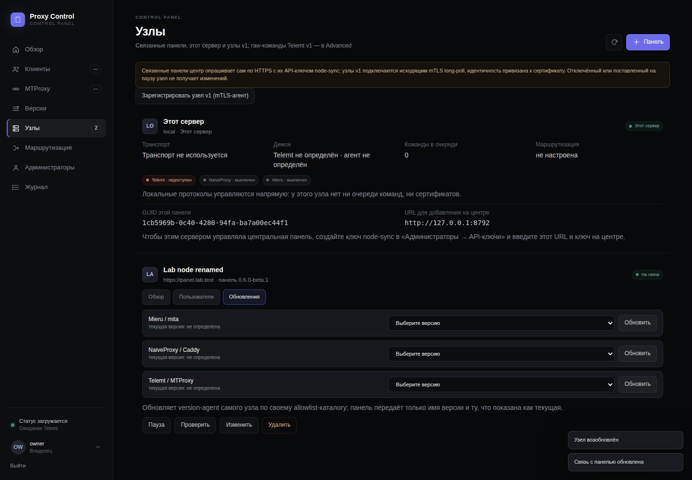

# Proxy Control v0.6.0-beta.1

> **Статус / Status:** Beta — выпуск-сверка: ни одной новой функции; всё, что обещано в v0.2–v0.5, проверено на стенде `ams-test` через настоящий API и настоящий браузер и живьём на боевом узле `AMS_Z`, найденное — исправлено. См. таблицу гейта, «Что нашла сверка» и «Живая проверка» ниже (заполнены по прогонам 2026-09-17). / Beta — the verification release: no new function; everything promised in v0.2–v0.5 proven on the lab host `ams-test` through the real API and a real browser and live on the production node `AMS_Z`, with what that found fixed. See the gate table, «What the verification found» and «Live check» below (filled in from the runs of 2026-09-17).

> **Руководство / Guide:** [руководство оператора v0.6](v0.6-operator-guide.ru.md) — архитектура, домены, автоматическое развёртывание, узлы, доступы из центра, маршрутизация; протокол для ИИ-агентов — [AGENTS.md](../../AGENTS.md). / The v0.6 operator guide (Russian) and the AI-agent protocol.
>
> **Архив / Archive:** `proxy-control-v0.6.0-beta.1.tar.gz` — `sha256` `882d82a980e5c01bb09a4df3587fee482fc1fbb78f6439cf0da3a44a81fa924a`, дерево тега `5718663`; собран дважды на `ams-test` из чистого клона (`/root/release-check-v06`, байты совпали), тот же digest в аннотации тега (`lab-sha256`), workflow [`Release`](https://github.com/dubr1k/proxy-control/actions/runs/35215016048) собрал дважды и сверил, опубликованные `SHA256SUMS` совпали с стендовыми, attestation (SLSA v1) проверена `gh attestation verify`; [страница выпуска](https://github.com/dubr1k/proxy-control/releases/tag/v0.6.0-beta.1). Установка: `scripts/install-release.sh --version 0.6.0-beta.1 --sha256 882d82a980e5c01bb09a4df3587fee482fc1fbb78f6439cf0da3a44a81fa924a` или четыре шага из раздела «Установка». / `sha256` `882d82a980e5c01bb09a4df3587fee482fc1fbb78f6439cf0da3a44a81fa924a`, tagged tree `5718663`; built twice on `ams-test` from a clean clone (`/root/release-check-v06`, bytes equal), the same digest in the tag annotation (`lab-sha256`), the [`Release`](https://github.com/dubr1k/proxy-control/actions/runs/35215016048) workflow built twice and compared, the published `SHA256SUMS` equal the lab's, the attestation (SLSA v1) verified with `gh attestation verify`; [release page](https://github.com/dubr1k/proxy-control/releases/tag/v0.6.0-beta.1). Install: `scripts/install-release.sh --version 0.6.0-beta.1 --sha256 882d82a980e5c01bb09a4df3587fee482fc1fbb78f6439cf0da3a44a81fa924a` or the four steps under «Installing».

Журнал изменений / Changelog: [CHANGELOG.ru.md](../../CHANGELOG.ru.md) · [CHANGELOG.md](../../CHANGELOG.md). Матрица сверки / Verification matrix: [VERIFICATION_MATRIX.md](../VERIFICATION_MATRIX.md). Документация / Documentation: [XRAY_ROUTER.ru.md](../XRAY_ROUTER.ru.md) · [ROUTING.ru.md](../ROUTING.ru.md) · [FLEET.ru.md](../../FLEET.ru.md) · [BACKUP_RESTORE.ru.md](../BACKUP_RESTORE.ru.md) · [UPGRADING.ru.md](../UPGRADING.ru.md) · [UPGRADING.md](../UPGRADING.md).

## Русский

### Что это за выпуск

v0.6 — результат проверки всех функций бэкенда и фронта за v0.2–v0.5 (поручение владельца 2026-09-17). Единица работы — строка матрицы: обещанная функция → доказательство, которое существует в дереве (тест, сценарий лаборатории, браузерный сценарий, живая проверка) → маршруты, которые она покрывает → статус. Матрица — 58 строк, все `proven` или `fixed-in-0.6`, ни одного `gap`; тест-страж не даёт сослаться на несуществующее доказательство, забыть маршрут (101) или экран (11) и выпустить релиз с пробелом.

Что добавилось ради этого: аудит маршрутов (`scripts/dev/route-coverage.py` в `full`), tier `ui` (`scripts/lab/ui-acceptance.py` — каждый экран в headless Chrome как владелец и наблюдатель, плюс вторая панель как центр; 180 проверок), tier `managed-xui` (управляемый 3x-ui против настоящего 3x-ui), сценарий `backup-restore` в `lab-host` (учение по `docs/BACKUP_RESTORE`), домен подписки и host version-agent на стенде. Подробно — [CHANGELOG.ru.md](../../CHANGELOG.ru.md).

### Что нашла сверка

- **Выдача доступов с экрана «Клиенты» отвечала 422 с v0.3** — диалог собирал протоколы по всему документу, и радио TLS диалога связи панелей попадало в список (`protocol: "verify"`); рядом Mieru отказывал `options: {}`. Исправлено (сбор ограничен формой; «без квоты» — по умолчанию).
- **Полосы CPU/RAM/диска на обзоре никогда не заполнялись** — inline `style` резала CSP. Ширина идёт через CSSOM, inline style в модулях запрещён тестом.
- **Неверный пароль перезагружал форму входа пустой** — 401 на странице входа считался истёкшей сессией. Теперь показывается отказ сервера.
- **Политику нельзя было удалить сразу после отключения от роутера**; карточка маршрутизации на мгновение показывала политику предыдущего визита — оба закрыты.
- **`rollback`/`uninstall` установщика оставляли контейнер Xray-router** (реальный runner без `compose_service_present`) — найдено живьём на AMS_Z в v0.5, закрыто там же; в v0.6 — тест на реальный runner.
- **Три маршрута без единого теста** (квоты Mieru, resume операции, обновление версии на узле с центра) — получили тесты; все прошли.
- **Приёмка управляемого 3x-ui падала** на отсутствующем сертификате панели, а отказ 3x-ui ничего не говорил — приёмка выпускает сертификат, отказ называет род причины (не повторяя сообщение панели).
- **Найдено после выпуска, владельцем на AMS_Z:** строки «Журнала действий» на широких экранах накладывали исполнителя на раскрывашку «Детали и IP» — правило v0.1 с четырьмя колонками на `.audit-row` пережило раскладку v0.2 (tier `ui` снял этот кадр, но проверки на пересечение ячеек не имел, и я его пропустил). Исправлено в ветке после тега (`CHANGELOG` → Unreleased): строка — одна колонка, tier `ui` проверяет `audit.cells_do_not_overlap`, тест не пускает многоколоночное правило; `audit.png` ниже пересняли после исправления, в дереве тега лежит кадр с наложением.

### Обновление

Обычное обновление v0.5 → v0.6: `panel/`, `naive_manager/`, `mieru_manager/`, `xray_router_manager/`, `installer/`, `compose*.yaml`, `scripts/`, `VERSION` → `docker compose up -d --build --wait panel naive-manager mieru-manager` (и `xray-router`, если установлен). Новых миграций нет (схема 15), wire-формат Fleet v2 не менялся, `MieruOptions.quotas` получила значение по умолчанию (совместимо). С v0.4 и v0.3 — по цепочке разделов `docs/UPGRADING.ru.md`.

### Установка

**Что нужно.** VPS **x86-64** на **Ubuntu 24.04** с `systemd`, вход обычным пользователем с `sudo`; публичный IPv4 без NAT; свободные TCP/443 и TCP/80 (режим `fresh`) либо свой Nginx `stream` на 443 с одной картой `$ssl_preread_server_name` (режим `coexist`); домены панели и MTProxy (всегда), NaiveProxy и Mieru (по профилю), необязательный домен подписки — с A-записями на этот сервер, без чужих AAAA и без CDN перед MTProxy (сертификаты — Let's Encrypt HTTP-01); закреплённые внешние артефакты (`mita_3.36.0_amd64.deb` и `mieru_3.36.0_amd64.deb` для профилей с Mieru, `Xray-linux-64.zip` для роутера) класть не нужно — установщик скачивает их сам в `/var/lib/proxy-control/` и сверяет SHA-256, а хост без интернета кладёт их туда заранее (URL и SHA-256 — `release/external-artifacts.json`); Python 3.11+ (в Ubuntu 24.04 — 3.12), `curl`, `tar`, `sha256sum`. WARP и роутер необязательны: секция `[egress]` в `install.toml` или вопросы мастера (мастер предлагает роутер каждому профилю с NaiveProxy или Mieru).

**Что устанавливается.** Недостающие пакеты Ubuntu (`ca-certificates certbot curl docker-compose-v2 docker.io nginx-full openssl python3` — только они попадают под владение установщика); сертификаты Let's Encrypt с проверкой продления сразу; блок SNI-маршрутов Nginx на общем 443 и TLS-vhost панели; Compose-проект `mtproxy` в `/opt/mtproxy-shared443` (контейнеры `proxy-control-panel`, `-mtproxy` (Telemt), `-mask`, по профилю `-naive-manager`, `-mieru-manager` и `-xray-router`; тома, `secrets/`, мастер-ключ панели); host-службы `caddy-naive.service` (NaiveProxy) и `mita.service` (Mieru) по профилю; бинари роутера в `/usr/local/lib/proxy-control/xray-router` и состояние в `/var/lib/xray-router`; правила UFW — только с вашего разрешения и только на свежем хосте; журнал транзакции, владение и отчёты — `/var/lib/proxy-control/`. Каждый шаг журналируется и откатывается; ничего не меняется до подтверждения digest плана. Полный список — `scripts/install-release.sh --requirements` и [INSTALLER_REFERENCE.ru.md](../INSTALLER_REFERENCE.ru.md).

**Как.** `install-bootstrap` отказывает предрелизным версиям, поэтому бета ставится четырьмя шагами без него (см. [INSTALL.ru.md](../../INSTALL.ru.md)); скрипт [`scripts/install-release.sh`](../../scripts/install-release.sh) делает их сам — без root до проверки байтов, без «скачать и выполнить одной командой»:

```bash
# вручную: четыре файла со страницы выпуска, затем
sha256sum --check SHA256SUMS
tar -xzf proxy-control-v0.6.0-beta.1.tar.gz
cd proxy-control
sudo python3 -m installer.cli wizard

# или скриптом (из клона репозитория или скачанным и прочитанным отдельно):
scripts/install-release.sh --requirements                      # что нужно и что устанавливается
scripts/install-release.sh --version 0.6.0-beta.1 --sha256 <lab-sha256 из таблицы гейта>
# --check-only — только скачать и проверить; --no-wizard — распаковать без запуска; -- plan --config … --json — план без изменений
```

### Чек-лист гейта (стенд `ams-test`)

| Гейт | Результат |
| --- | --- |
| `scripts/dev/remote-gate.sh full` (с `VERIFICATION_STRICT=1`) | `REMOTE_GATE_FULL_OK` 2026-09-17 на `073a270`: образы panel/mieru-manager/xray-router, ruff, pytest 2170 passed / 3 skipped (487 с; матрица без `gap`), unittest `test_deploy`, `route-coverage.py` (101 маршрут, 0 проблем), doc-links, JS-синтаксис, `bash -n`/shellcheck, `systemd-analyze verify`, `git diff --check` |
| `scripts/dev/remote-gate.sh compose` | `REMOTE_GATE_COMPOSE_OK` на `7205c70` |
| `scripts/dev/remote-gate.sh lab-container` | `REMOTE_GATE_LAB_CONTAINER_OK` на `e29d3fa` (9 контейнерных сценариев до установки: preflight, целостность артефакта, audit, plan, nginx-multi-map, coexist-existing-xui, uninstall-foreign-identity, dns-tls, secrets-scan) |
| `LAB_RESET=1 LAB_KEEP_INSTALL=0 scripts/dev/remote-gate.sh lab-host` (с uninstall и coexistence) | `REMOTE_GATE_LAB_HOST_OK` на `e29d3fa`: 20 сценариев `passed` — install 119,1 с, repair 42,9 с, idempotence 4,6 с, **backup-restore 63,9 с**, reboot-recovery 65,9 с, crash-every-phase 1,7 с, fleet 197,5 с, secrets-scan, **uninstall 29,9 с, coexistence** |
| `LAB_RESET=1 LAB_KEEP_INSTALL=1 scripts/dev/remote-gate.sh lab-host` | `REMOTE_GATE_LAB_HOST_OK` на `7205c70` (финальное дерево): 18 сценариев `passed` (install 117,4 с, repair 40,9 с, backup-restore 61,8 с, reboot-recovery 64,2 с, fleet 192,7 с), uninstall/coexistence `skipped` (узел оставлен для tier'ов) |
| `scripts/dev/remote-gate.sh fleet` | `REMOTE_GATE_FLEET_OK`: 84/84, 198,2 с |
| `scripts/dev/remote-gate.sh routing` | `REMOTE_GATE_ROUTING_OK`: 154/154, 292,7 с |
| `scripts/dev/remote-gate.sh router` | `REMOTE_GATE_ROUTER_OK`: 242/242 (88 router-01…14), 473,1 с (шаг роутера 171,7 с) |
| `scripts/dev/remote-gate.sh ui` | `REMOTE_GATE_UI_OK`: **180/180 за 123 с** в headless Chrome — 11 экранов узла (вход 4,9 с, обзор 2,9, MTProxy 4,3, Naive 7,3, Mieru 9,1, клиенты 18,0, версии 1,2, узлы 1,5, маршрутизация 17,6, администраторы 7,7, журнал 2,0) и центр 38,5 с; без ошибок консоли, без исключений, без секретов в кадрах; runtime-пользователи узла = исходным |
| `scripts/dev/remote-gate.sh managed-xui` | `REMOTE_GATE_MANAGED_XUI_OK`: настоящий 3x-ui 3.7.0 поставлен, настроен через API, панель на loopback, все обещанные inbound слушают — 12 с |
| `lab-sha256` архива гейта | `f78de43aeb8153c9fc0ea4492c2b577144984e48142d6c199f554c23ea26bc2a` (дерево `7205c70`; тегированное дерево `5718663` отличается только документами — его digest `882d82a9…` в аннотации тега и в блоке «Архив») |

### Скриншоты

Сняты 2026-09-17 tier'ом `ui` на стенде по политике v0.4/v0.5: только стендовые данные (установка `lab-host` `https://panel.lab.test`, центр — вторая панель из дерева на `127.0.0.1`, провайдер — SOCKS5-stub на loopback, имена — с префиксом прогона), headless Chrome по CDP, 1440 px и 390 px, PNG без метаданных, каждый ≤ 150 КБ; ни секрета, ни боевого имени в кадре нет.

- обзор с заполненными полосами ресурсов (исправление CSP): [`dashboard.png`](assets/v0.6.0-beta.1/dashboard.png); MTProxy, NaiveProxy, Mieru: [`users.png`](assets/v0.6.0-beta.1/users.png) · [`naive.png`](assets/v0.6.0-beta.1/naive.png) · [`mieru.png`](assets/v0.6.0-beta.1/mieru.png);
- клиенты с доступами на три протокола и принятым импортом: [`clients.png`](assets/v0.6.0-beta.1/clients.png); версии с host version-agent: [`versions.png`](assets/v0.6.0-beta.1/versions.png); администраторы и API-ключи: [`admins.png`](assets/v0.6.0-beta.1/admins.png); журнал прогона: [`audit.png`](assets/v0.6.0-beta.1/audit.png);
- центр: «Узлы» со связанным узлом стенда (вкладка «Обновления» с компонентами узла): [`central-nodes.png`](assets/v0.6.0-beta.1/central-nodes.png); клиент с доступом, доставленным на узел: [`central-clients.png`](assets/v0.6.0-beta.1/central-clients.png); узел, пока им управляет центр: [`node-managed.png`](assets/v0.6.0-beta.1/node-managed.png);
- маршрутизация на 390 px: [`routing-mobile.png`](assets/v0.6.0-beta.1/routing-mobile.png).



### Живая проверка (AMS_Z)

Проведена 2026-09-17 10:36–10:52 UTC по разрешению владельца (то же, что для v0.3–v0.5). **Узел** — боевой хост `AMS_Z` (`https://api.dubr1k-kawai.uk`, реальные пользователи 5/4/3, WARP proxy mode на `127.0.0.1:45000`, рукописный `upstream http://127.0.0.1:8118` в Caddyfile NaiveProxy, mita с секцией `egress`), с v0.5.0-beta.1 без роутера; обновлён rsync'ом с дерева `7205c70`. Ни один секрет в отчёт не попал (`/root/v06-live/ui-live/report.json`, root).

**Обновление v0.5 → v0.6 на месте.** Точки отката в `/root/v06-live/` (`20260917T103647Z`: онлайн-бэкап `panel.sqlite3` (`integrity_check` = ok, 15 миграций), tar кода без секретов, теги образов `*:rollback-20260917T103647Z`, копия Caddyfile, `mita describe config`, `.env`, `docker ps`) → rsync `panel/ naive_manager/ mieru_manager/ xray_router_manager/ installer/ compose*.yaml VERSION` и четыре скрипта → `docker compose build panel naive-manager mieru-manager` → `up -d --wait --no-deps panel naive-manager mieru-manager` — 27 с до `healthy`; `db-status`: 15 applied, `checksum_ok` у всех (новых миграций у v0.6 нет), `/app/VERSION` = `0.6.0-beta.1`, `mtproxy` и `mask` не пересозданы, `caddy-naive`/`mita` активны, в журнале панели ошибок нет.

**Экраны через их API** (`ui-acceptance.py --api-only` на самом узле — браузера на боевом хосте нет, а пароль владельца его не покидает): вход владельцем; данные всех экранов — обзор, MTProxy, NaiveProxy, Mieru, клиенты, версии, узлы, маршрутизация, администраторы, API-ключи, журнал, события, совместимость подписок — отвечают 200 и не содержат ни одной формы секрета; по одному пробному пользователю на протокол (`live-ui-5f4010-*`): создан → one-time reveal (ссылка MTProxy / `clients.native` у Naive и Mieru) → удалён; списки пользователей после = до (5/4/3). 21/21 за 7,3 с. Итог: sha256 Caddyfile = снимку (`0e3a8ea0d18cdeb1…` — тот же, что после живых проверок v0.4 и v0.5), `mita describe config` = снимку (`9e193e70f0000647…`), все сервисы `healthy`. Маршрутизацию и роутер на AMS_Z не трогали — они доказаны в v0.4/v0.5 и на стенде в этой версии.

**Наблюдение.** Менеджер NaiveProxy тумбстонит имена навсегда: `live-ui-5f4010-nv` сожжено. AMS_Z остаётся на v0.6 без роутера; точки отката — `/root/v06-live/`, только root.

## English

### What this release is

v0.6 is the result of verifying every function of the backend and the front end from v0.2 to v0.5 (the owner's instruction of 2026-09-17). The unit of work is a matrix row: a promised function → a proof that exists in the tree (a test, a lab scenario, a browser scenario, a live check) → the routes it covers → a status. The matrix has 58 rows, all `proven` or `fixed-in-0.6`, no `gap`; its guard test refuses a proof that does not exist, a forgotten route (101) or screen (11), and a release with a hole.

What was added for it: the route audit (`scripts/dev/route-coverage.py` in `full`), tier `ui` (`scripts/lab/ui-acceptance.py` — every screen in headless Chrome as the owner and as a viewer, plus a second panel as the central; 180 checks), tier `managed-xui` (the managed 3x-ui against the real 3x-ui), the `backup-restore` scenario in `lab-host` (a drill by `docs/BACKUP_RESTORE`), a subscription domain and the host version-agent on the lab node. Details: [CHANGELOG.md](../../CHANGELOG.md).

### What the verification found

- **Issuing grants from the Clients screen answered 422 since v0.3** — the dialog collected protocols over the whole document and the link dialog's TLS radio leaked in (`protocol: "verify"`); beside it Mieru refused `options: {}`. Fixed (the collection scoped to the form; no quota by default).
- **The CPU/RAM/disk bars on the overview never filled** — an inline `style` the CSP drops. The width goes through the CSSOM; a test refuses inline styles in the modules.
- **A wrong password reloaded the login form blank** — a 401 on the login page was taken for an expired session. The server's refusal is shown now.
- **A policy could not be deleted right after a detach from the router**; the routing card showed the previous visit's policy for a moment — both closed.
- **The installer's `rollback`/`uninstall` left the Xray-router container** (the real runner without `compose_service_present`) — found live on AMS_Z in v0.5 and closed there; v0.6 adds the test on the real runner.
- **Three routes without a single test** (Mieru quotas, resuming an operation, a node's version update from the central) — tested now; all pass.
- **The managed-3x-ui acceptance failed** on a missing panel certificate and 3x-ui's refusal said nothing — the acceptance issues the certificate, the refusal names its kind (never repeating the panel's message).
- **Found after the publication, by the owner on AMS_Z:** the Journal's rows overlapped the actor and the «Details and IP» disclosure at desktop widths — a v0.1 four-column rule on `.audit-row` had survived the v0.2 layout (the `ui` tier captured that frame but had no cell-overlap check, and I missed it). Fixed on the branch after the tag (`CHANGELOG` → Unreleased): the row is one column, the `ui` tier checks `audit.cells_do_not_overlap`, a test refuses a multi-track rule; `audit.png` below was retaken after the fix, the tagged tree keeps the overlapping frame.

### Upgrading

An ordinary upgrade v0.5 → v0.6: `panel/`, `naive_manager/`, `mieru_manager/`, `xray_router_manager/`, `installer/`, `compose*.yaml`, `scripts/`, `VERSION` → `docker compose up -d --build --wait panel naive-manager mieru-manager` (and `xray-router` where installed). No new migration (schema 15), the Fleet v2 wire format unchanged, `MieruOptions.quotas` gained a default (compatible). From v0.4 and v0.3 — through the chain of sections in `docs/UPGRADING.md`.

### Installing

**Requirements.** An **x86-64** VPS on **Ubuntu 24.04** with `systemd`, a regular user with `sudo`; a public IPv4 without NAT; free TCP/443 and TCP/80 (`fresh`) or your own Nginx `stream` on 443 with one `$ssl_preread_server_name` map (`coexist`); the panel and MTProxy domains (always), NaiveProxy and Mieru (per profile), an optional subscription domain — with A records at this server, no foreign AAAA and no CDN in front of MTProxy (Let's Encrypt HTTP-01); the pinned external artifacts (`mita_3.36.0_amd64.deb` and `mieru_3.36.0_amd64.deb` for the Mieru profiles, `Xray-linux-64.zip` for the router) need no staging — the installer fetches them into `/var/lib/proxy-control/` and proves their SHA-256, an offline host stages them there in advance (URLs and SHA-256 in `release/external-artifacts.json`); Python 3.11+ (3.12 on Ubuntu 24.04), `curl`, `tar`, `sha256sum`. WARP and the router are optional: the `[egress]` section of `install.toml` or the wizard's questions (the wizard asks about the router only when the archive is staged).

**What gets installed.** Missing Ubuntu packages (`ca-certificates certbot curl docker-compose-v2 docker.io nginx-full openssl python3` — only those come under the installer's ownership); Let's Encrypt certificates with a renewal dry-run; the SNI route block on the shared 443 and the panel's TLS vhost; the Compose project `mtproxy` in `/opt/mtproxy-shared443` (containers `proxy-control-panel`, `-mtproxy` (Telemt), `-mask`, per profile `-naive-manager`, `-mieru-manager` and `-xray-router`; volumes, `secrets/`, the panel master key); the host services `caddy-naive.service` (NaiveProxy) and `mita.service` (Mieru) per profile; the router's binaries in `/usr/local/lib/proxy-control/xray-router` and its state in `/var/lib/xray-router`; UFW rules only with your consent and only on a fresh host; the transaction journal, ownership and reports in `/var/lib/proxy-control/`. Every step is journaled and reversible; nothing changes before the plan digest is confirmed. The full list: `scripts/install-release.sh --requirements` and [INSTALLER_REFERENCE.en.md](../INSTALLER_REFERENCE.en.md).

**How.** `install-bootstrap` refuses pre-releases, so a beta is installed in four steps without it (see [INSTALL.en.md](../../INSTALL.en.md)); [`scripts/install-release.sh`](../../scripts/install-release.sh) does them for you — no root before the bytes are verified, no «download and run in one line»:

```bash
# by hand: the four files from the release page, then
sha256sum --check SHA256SUMS
tar -xzf proxy-control-v0.6.0-beta.1.tar.gz
cd proxy-control
sudo python3 -m installer.cli wizard

# or with the script (from a clone, or downloaded and read separately):
scripts/install-release.sh --requirements                      # what is needed and what gets installed
scripts/install-release.sh --version 0.6.0-beta.1 --sha256 <lab-sha256 from the gate table>
# --check-only — download and verify only; --no-wizard — extract without running; -- plan --config … --json — a plan without changes
```

### Gate checklist (lab host `ams-test`)

| Gate | Result |
| --- | --- |
| `scripts/dev/remote-gate.sh full` (with `VERIFICATION_STRICT=1`) | `REMOTE_GATE_FULL_OK` 2026-09-17 on `073a270`: panel/mieru-manager/xray-router images, ruff, pytest 2170 passed / 3 skipped (487 s; the matrix without a `gap`), unittest `test_deploy`, `route-coverage.py` (101 routes, 0 problems), doc-links, JS syntax, `bash -n`/shellcheck, `systemd-analyze verify`, `git diff --check` |
| `scripts/dev/remote-gate.sh compose` | `REMOTE_GATE_COMPOSE_OK` on `7205c70` |
| `scripts/dev/remote-gate.sh lab-container` | `REMOTE_GATE_LAB_CONTAINER_OK` on `e29d3fa` (the 9 pre-install container scenarios: preflight, artifact integrity, audit, plan, nginx-multi-map, coexist-existing-xui, uninstall-foreign-identity, dns-tls, secrets-scan) |
| `LAB_RESET=1 LAB_KEEP_INSTALL=0 scripts/dev/remote-gate.sh lab-host` (with uninstall and coexistence) | `REMOTE_GATE_LAB_HOST_OK` on `e29d3fa`: 20 scenarios `passed` — install 119.1 s, repair 42.9 s, idempotence 4.6 s, **backup-restore 63.9 s**, reboot-recovery 65.9 s, crash-every-phase 1.7 s, fleet 197.5 s, secrets-scan, **uninstall 29.9 s, coexistence** |
| `LAB_RESET=1 LAB_KEEP_INSTALL=1 scripts/dev/remote-gate.sh lab-host` | `REMOTE_GATE_LAB_HOST_OK` on `7205c70` (the final tree): 18 scenarios `passed` (install 117.4 s, repair 40.9 s, backup-restore 61.8 s, reboot-recovery 64.2 s, fleet 192.7 s), uninstall/coexistence `skipped` (the node is kept for the tiers) |
| `scripts/dev/remote-gate.sh fleet` | `REMOTE_GATE_FLEET_OK`: 84/84, 198.2 s |
| `scripts/dev/remote-gate.sh routing` | `REMOTE_GATE_ROUTING_OK`: 154/154, 292.7 s |
| `scripts/dev/remote-gate.sh router` | `REMOTE_GATE_ROUTER_OK`: 242/242 (88 router-01…14), 473.1 s (the router step 171.7 s) |
| `scripts/dev/remote-gate.sh ui` | `REMOTE_GATE_UI_OK`: **180/180 in 123 s** in headless Chrome — the node's 11 screens (login 4.9 s, overview 2.9, MTProxy 4.3, Naive 7.3, Mieru 9.1, clients 18.0, versions 1.2, nodes 1.5, routing 17.6, admins 7.7, journal 2.0) and the central 38.5 s; no console error, no exception, no secret in a frame; the node's runtime users equal the initial ones |
| `scripts/dev/remote-gate.sh managed-xui` | `REMOTE_GATE_MANAGED_XUI_OK`: the real 3x-ui 3.7.0 installed, configured through its API, the panel on loopback, every promised inbound listening — 12 s |
| `lab-sha256` of the gate archive | `f78de43aeb8153c9fc0ea4492c2b577144984e48142d6c199f554c23ea26bc2a` (tree `7205c70`; the tagged tree `5718663` differs by documents only — its digest `882d82a9…` is in the tag annotation and the «Archive» block) |

### Screenshots

Captured on 2026-09-17 by the `ui` tier on the lab host under the v0.4/v0.5 policy: lab data only (the `lab-host` install `https://panel.lab.test`, the central a second panel from the tree on `127.0.0.1`, the provider a SOCKS5 stub on loopback, names with the run's prefix), headless Chrome over CDP, 1440 px and 390 px, PNG without metadata, each ≤ 150 KB; no secret and no production name in any frame.

- the overview with its usage bars filled (the CSP fix): [`dashboard.png`](assets/v0.6.0-beta.1/dashboard.png); MTProxy, NaiveProxy, Mieru: [`users.png`](assets/v0.6.0-beta.1/users.png) · [`naive.png`](assets/v0.6.0-beta.1/naive.png) · [`mieru.png`](assets/v0.6.0-beta.1/mieru.png);
- clients with grants on three protocols and an adopted import: [`clients.png`](assets/v0.6.0-beta.1/clients.png); versions with the host version-agent: [`versions.png`](assets/v0.6.0-beta.1/versions.png); admins and API keys: [`admins.png`](assets/v0.6.0-beta.1/admins.png); the run's journal: [`audit.png`](assets/v0.6.0-beta.1/audit.png);
- the central: «Nodes» with the linked lab node (the «Updates» tab with the node's components): [`central-nodes.png`](assets/v0.6.0-beta.1/central-nodes.png); a client with a grant delivered to the node: [`central-clients.png`](assets/v0.6.0-beta.1/central-clients.png); the node while the central manages it: [`node-managed.png`](assets/v0.6.0-beta.1/node-managed.png);
- routing at 390 px: [`routing-mobile.png`](assets/v0.6.0-beta.1/routing-mobile.png).


### Live check (AMS_Z)

Run on 2026-09-17 10:36–10:52 UTC under the owner's permission (the same as for v0.3–v0.5). **The node** — the production host `AMS_Z` (`https://api.dubr1k-kawai.uk`, real users 5/4/3, WARP proxy mode on `127.0.0.1:45000`, a hand-written `upstream http://127.0.0.1:8118` in the NaiveProxy Caddyfile, mita with an `egress` section), on v0.5.0-beta.1 without a router; updated by rsync from tree `7205c70`. No secret reached the report (`/root/v06-live/ui-live/report.json`, root only).

**In-place upgrade v0.5 → v0.6.** Rollback points in `/root/v06-live/` (`20260917T103647Z`: an online backup of `panel.sqlite3` (`integrity_check` = ok, 15 migrations), a code tar without secrets, image tags `*:rollback-20260917T103647Z`, a copy of the Caddyfile, `mita describe config`, `.env`, `docker ps`) → rsync `panel/ naive_manager/ mieru_manager/ xray_router_manager/ installer/ compose*.yaml VERSION` and the four scripts → `docker compose build panel naive-manager mieru-manager` → `up -d --wait --no-deps panel naive-manager mieru-manager` — 27 s to `healthy`; `db-status`: 15 applied, every `checksum_ok` (v0.6 adds no migration), `/app/VERSION` = `0.6.0-beta.1`, `mtproxy` and `mask` not recreated, `caddy-naive`/`mita` active, no error in the panel log.

**The screens through their API** (`ui-acceptance.py --api-only` on the node itself — there is no browser on the production host and the owner's password does not leave it): login as the owner; the data of every screen — overview, MTProxy, NaiveProxy, Mieru, clients, versions, nodes, routing, admins, API keys, journal, events, subscription compatibility — answers 200 with no secret shape in it; one throw-away user per protocol (`live-ui-5f4010-*`): created → one-time reveal (the MTProxy link / `clients.native` for Naive and Mieru) → deleted; the user lists after = before (5/4/3). 21/21 in 7.3 s. Outcome: the Caddyfile's sha256 equals the snapshot (`0e3a8ea0d18cdeb1…` — the same as after the v0.4 and v0.5 live checks), `mita describe config` equals the snapshot (`9e193e70f0000647…`), every service `healthy`. Routing and the router were not touched on AMS_Z — proven in v0.4/v0.5 and on the lab host in this version.

**Observation.** The NaiveProxy manager tombstones names for good: `live-ui-5f4010-nv` is burnt. AMS_Z stays on v0.6 without a router; rollback points: `/root/v06-live/`, root only.
