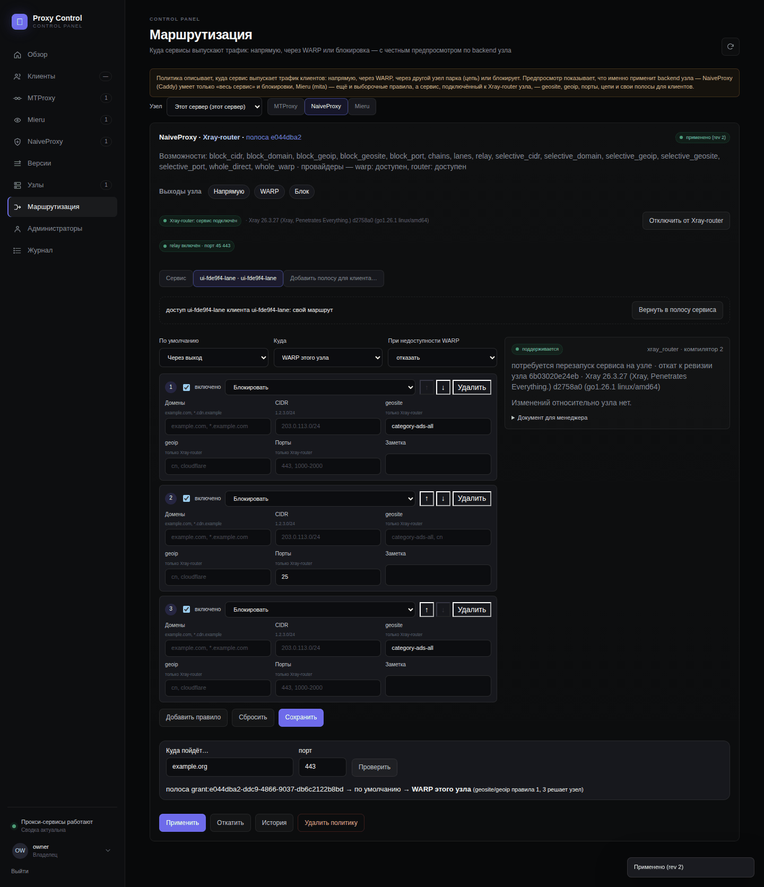

# Proxy Control v0.7.0-beta.1

> **Статус / Status:** Beta — цепи и полосы: трафик отдельного клиента по правилам geosite/geoip уходит через выбранный узел парка, остальное — через WARP узла; настраивается на каждого клиента из центральной панели. Проверено на стенде `ams-test` (tier'ы `chains`, `fleet`, `ui` и все остальные) и живьём: AMS_Z как центр с роутером → ams-test как связанный узел-выход. См. таблицу гейта и «Живая проверка» ниже. / Beta — chains and lanes: one client's traffic routed by geosite/geoip rules through a chosen node of the fleet, the rest through the node's WARP, set up per client from the central panel. Proven on the lab host `ams-test` (the `chains`, `fleet`, `ui` and every other tier) and live: AMS_Z as the central with a router → ams-test as the linked exit node. See the gate table and «Live check» below.

> **Руководство / Guide:** [руководство оператора](v0.6-operator-guide.ru.md) — §8.8 «Цепи и полосы» (пошагово для владельца); протокол для ИИ-агентов — [AGENTS.md](../../AGENTS.md) (алгоритм E6). / The operator guide (Russian, §8.8) and the AI-agent protocol (algorithm E6).
>
> **Архив / Archive:** _(заполняется при публикации / filled at publication)_

Журнал изменений / Changelog: [CHANGELOG.ru.md](../../CHANGELOG.ru.md) · [CHANGELOG.md](../../CHANGELOG.md). Решение / Decision: [ADR 009](../adr/009-lanes-and-chains.md). Документация / Documentation: [ROUTING.ru.md](../ROUTING.ru.md) · [XRAY_ROUTER.ru.md](../XRAY_ROUTER.ru.md) · [INSTALLER_REFERENCE.ru.md](../INSTALLER_REFERENCE.ru.md) · [UPGRADING.ru.md](../UPGRADING.ru.md) · [UPGRADING.md](../UPGRADING.md) · [VERIFICATION_MATRIX.md](../VERIFICATION_MATRIX.md).

## Русский

### Что это за выпуск

Поручение владельца: *«клиент — это я; я отправляю трафик через AMS_Z, который отправляет его на ams-test; хочу, чтобы мой трафик по geosite/geoip шёл на выбранный сервер, а остальное — через внутренний WARP; удобно настраивать цепи; и для каждого созданного клиента»*. Три вещи, которых не было в модели v0.4–v0.6, появились: **полоса** (политика одного доступа, а не всего сервиса), **выход через другой узел парка** (relay + учётки, которые выдаёт центр) и **цепь** (до трёх узлов). Всё это работает только на сервисе, подключённом к Xray-router узла, и не трогает нативные backend'ы.

Как это устроено — [ADR 009](../adr/009-lanes-and-chains.md) и [ROUTING](../ROUTING.ru.md) «Цепи и полосы»; что именно добавилось — [CHANGELOG.ru.md](../../CHANGELOG.ru.md).

### Что нашла проверка

- **Роутер падал в цикле при старте** после снятия полосы: `lanes.json` терял учётку раньше, чем intent — нашёл tier `chains`; теперь снятие атомарно, старт и откат вычищают полосы без учётки.
- **Узел не сходился после снятия полосы** (секция сервиса продолжала нести цепь к остановленному узлу B) — следующее поколение идёт без полосы.
- **Слот `mita@4` не успевал открыть RPC** к проверке установщика — ожидание с повторами; **`metrics.pb` делился** между демонами mita — у слота свой `/var/lib/mita`.
- **Правило `geoip:cloudflare → напрямую` ловило `api.ipify.org`** (он за Cloudflare) — цель сценария заменена; **гонка unlink ↔ heartbeat** давала traceback; **предпросмотр отправлял недописанное правило** — исправлено.

### Обновление

`docs/UPGRADING.ru.md` → «Обновление до v0.7»: обычная замена кода и `docker compose up -d --build`, миграция 16 при старте; relay и слоты — повторным `install` того же TOML (по умолчанию `relay_port = 45443`, `lane_slots = 4`) или руками; порядок в парке — узлы, затем центр; откат — предыдущее поколение с базой, полосы снять до отката.

### Установка

Как в v0.6 ([INSTALL.ru.md](../../INSTALL.ru.md), `scripts/install-release.sh --version 0.7.0-beta.1 --sha256 <lab-sha256>`); с `[egress] router = true` установщик ставит relay (45443/tcp) и четыре слота Mieru (46101–46104/tcp) и открывает их в UFW.

### Чек-лист гейта (стенд `ams-test`)

| Гейт | Результат |
| --- | --- |
| `scripts/dev/remote-gate.sh full` (с `VERIFICATION_STRICT=1`) | `REMOTE_GATE_FULL_OK` 2026-09-18 на `bbcab08` (pytest **2283 passed / 3 skipped**, 506,8 с) и снова на `8fbf13d` после исправления установщика (**2285 passed / 3 skipped**, 502,5 с; матрица 64 строки без `gap`): образы panel/mieru-manager/xray-router, ruff, unittest `test_deploy` (34), `route-coverage.py` (107 маршрутов, 0 проблем), doc-links, JS-синтаксис, `bash -n`/shellcheck, `systemd-analyze verify`, `git diff --check`; тест-страж подписей журнала — `quick` на `41ec41e` |
| `scripts/dev/remote-gate.sh compose` | `REMOTE_GATE_COMPOSE_OK` на `bbcab08` и на `41ec41e` |
| `scripts/dev/remote-gate.sh lab-container` | `REMOTE_GATE_LAB_CONTAINER_OK` на `bbcab08` и на `41ec41e` (9 контейнерных сценариев до установки: preflight, целостность артефакта, audit, plan, nginx-multi-map, coexist-existing-xui, uninstall-foreign-identity, dns-tls, secrets-scan) |
| `LAB_RESET=1 LAB_KEEP_INSTALL=0 scripts/dev/remote-gate.sh lab-host` (с uninstall и coexistence) | `REMOTE_GATE_LAB_HOST_OK` на `bbcab08` (install 119,9 с, repair 42,3 с, backup-restore 62,9 с, reboot-recovery 65,2 с, fleet 195,5 с, uninstall 32,3 с) и на `41ec41e` (финальное дерево): 20 сценариев `passed` — install 118,5 с, repair 43,1 с, idempotence 4,0 с, **backup-restore 62,9 с**, reboot-recovery 66,4 с, crash-every-phase 1,8 с, fleet 196,1 с, secrets-scan, **uninstall 30,7 с, coexistence** |
| `LAB_RESET=1 LAB_KEEP_INSTALL=1 scripts/dev/remote-gate.sh lab-host` | `REMOTE_GATE_LAB_HOST_OK` на `bbcab08` (18 `passed`: install 119,6 с, repair 43,7 с, backup-restore 63,4 с, reboot-recovery 64,9 с, fleet 202,4 с; uninstall/coexistence `skipped`) и на `41ec41e` — _(см. ниже)_ |
| `scripts/dev/remote-gate.sh fleet` | `REMOTE_GATE_FLEET_OK` на `bbcab08`: 84/84, 198,9 с |
| `scripts/dev/remote-gate.sh routing` | `REMOTE_GATE_ROUTING_OK` на `bbcab08`: 154/154, 302,1 с |
| `scripts/dev/remote-gate.sh router` | `REMOTE_GATE_ROUTER_OK` на `bbcab08`: 242/242 (88 router-01…14), 472,8 с (шаг роутера 174,0 с) |
| `scripts/dev/remote-gate.sh chains` | `REMOTE_GATE_CHAINS_OK` на `bbcab08`: **277/277** (35 c01…c10 рядом с routing/router; узел B из дерева на стенде, relay через поколение, полоса с цепью, `geoip → напрямую`, слот Mieru, ротация, откат, снятие), 531,3 с (шаг цепей 64,5 с) — отсоединённый прогон на хосте |
| `scripts/dev/remote-gate.sh ui` | `REMOTE_GATE_UI_OK` на `bbcab08`: **197/197 за 145,7 с** в headless Chrome — 11 экранов узла (вход 4,7 с, обзор 2,6, MTProxy 4,2, Naive 6,6, Mieru 8,3, клиенты 17,3, версии 1,2, узлы 1,7, маршрутизация 36,9 — включая полосу клиента в браузере, администраторы 8,4, журнал 2,1) и центр 40,2 с; без ошибок консоли, без исключений, без секретов в кадрах; runtime-пользователи узла = исходным; на `41ec41e` — _(см. ниже)_ |
| `scripts/dev/remote-gate.sh managed-xui` | `REMOTE_GATE_MANAGED_XUI_OK` на `bbcab08`: настоящий 3x-ui 3.7.0 поставлен, настроен через API, панель на loopback, все обещанные inbound слушают — 15 с |
| `lab-sha256` архива гейта | `a2dc937903b01ee61f613776c123f7de85b911dec34d08683d039c19a96ab0ee` (дерево `bbcab08`, tier'ы fleet/routing/router/chains/ui/managed-xui), `920be8f8c927f77d35b8ba8bed859f0f5aded5f022d9f29feca6df83db1e2cb3` (дерево `41ec41e` с исправлением установщика — full/compose/lab-container/lab-host); digest тегированного дерева — в аннотации тега и в блоке «Архив» |

### Скриншоты

Сняты 2026-09-18 tier'ом `ui` на стенде по политике v0.4–v0.6: только стендовые данные (установка `lab-host` `https://panel.lab.test`, центр — вторая панель из дерева на `127.0.0.1`, провайдер — SOCKS5-stub на loopback, имена — с префиксом прогона), headless Chrome по CDP, 1440 px и 390 px, PNG без метаданных, каждый ≤ 150 КБ; ни секрета, ни боевого имени в кадре нет.

- **новое в v0.7** — маршрутизация сервиса на Xray-router с «Выходами узла» и relay: [`routing-naive-router-applied.png`](assets/v0.7.0-beta.1/routing-naive-router-applied.png); вкладка **полосы клиента** с её политикой, применённой на роутер, и «Куда пойдёт…»: [`routing-lane-applied.png`](assets/v0.7.0-beta.1/routing-lane-applied.png); клиенты с переключателем «маршрут: как у сервиса / своя полоса» на каждом доступе: [`clients.png`](assets/v0.7.0-beta.1/clients.png); центр — клиент с доступом на связанном узле и его полосой: [`central-clients.png`](assets/v0.7.0-beta.1/central-clients.png);
- обзор: [`dashboard.png`](assets/v0.7.0-beta.1/dashboard.png); MTProxy, NaiveProxy, Mieru: [`users.png`](assets/v0.7.0-beta.1/users.png) · [`naive.png`](assets/v0.7.0-beta.1/naive.png) · [`mieru.png`](assets/v0.7.0-beta.1/mieru.png); версии: [`versions.png`](assets/v0.7.0-beta.1/versions.png); администраторы и API-ключи: [`admins.png`](assets/v0.7.0-beta.1/admins.png); журнал прогона: [`audit.png`](assets/v0.7.0-beta.1/audit.png);
- центр: «Узлы» со связанным узлом стенда: [`central-nodes.png`](assets/v0.7.0-beta.1/central-nodes.png); узел, пока им управляет центр (relay включён, полосы центру): [`node-managed.png`](assets/v0.7.0-beta.1/node-managed.png); маршрутизация на 390 px: [`routing-mobile.png`](assets/v0.7.0-beta.1/routing-mobile.png).

### Живая проверка (AMS_Z → ams-test)

_(заполняется)_

## English

### What this release is

The owner's requirement: *«I am the client; I send my traffic through AMS_Z, which sends it on to ams-test; I want my traffic routed by geosite/geoip to a chosen server and the rest through the built-in WARP; chains set up conveniently; and for every client I create»*. Three things the v0.4–v0.6 model lacked arrived: a **lane** (one grant's policy rather than the whole service's), an **exit through another node of the fleet** (a relay with accounts the central issues) and a **chain** (up to three nodes). All of it lives on a service attached to the node's Xray-router and leaves the native backends alone.

How it works — [ADR 009](../adr/009-lanes-and-chains.md) and [ROUTING](../ROUTING.en.md) «Chains and lanes»; what exactly was added — [CHANGELOG.md](../../CHANGELOG.md).

### What the verification found

- **The router crash-looped at start** after a lane was withdrawn: `lanes.json` lost the account before the intent did — found by the `chains` tier; the withdrawal is atomic now, a start or a rollback strips account-less lanes.
- **A node stopped converging after a lane was withdrawn** (the service's section still carried the chain to a stopped node B) — the next generation goes without the lane.
- **Slot `mita@4` had not opened its RPC** by the installer's check — waited for with retries; **`metrics.pb` was shared** between mita daemons — a slot gets its own `/var/lib/mita`.
- **The rule `geoip:cloudflare → direct` caught `api.ipify.org`** (it sits behind Cloudflare) — the scenario's target changed; **an unlink racing a heartbeat** left a traceback; **the preview sent a half-typed rule** — all fixed.

### Upgrading

`docs/UPGRADING.md` → «Upgrading to v0.7»: the usual code swap and `docker compose up -d --build`, migration 16 on start; the relay and the slots through a repeated `install` of the same TOML (defaults `relay_port = 45443`, `lane_slots = 4`) or by hand; nodes before the central; rollback — the previous generation with its database, lanes withdrawn first.

### Installing

As in v0.6 ([INSTALL.en.md](../../INSTALL.en.md), `scripts/install-release.sh --version 0.7.0-beta.1 --sha256 <lab-sha256>`); with `[egress] router = true` the installer brings the relay (45443/tcp) and four Mieru slots (46101–46104/tcp) and opens them in UFW.

### Gate checklist (lab host `ams-test`)

_(the Russian table above holds the figures)_

### Screenshots

Captured on 2026-09-18 by the `ui` tier on the lab host under the v0.4–v0.6 policy: lab data only (the `lab-host` install `https://panel.lab.test`, the central a second panel from the tree on `127.0.0.1`, the provider a SOCKS5 stub on loopback, names with the run's prefix), headless Chrome over CDP, 1440 px and 390 px, PNG without metadata, each ≤ 150 KB; no secret and no production name in any frame.

- **new in v0.7** — a service's routing on the Xray-router with «Node exits» and the relay: [`routing-naive-router-applied.png`](assets/v0.7.0-beta.1/routing-naive-router-applied.png); the **client's lane** tab with its policy applied to the router and «Where will it go…»: [`routing-lane-applied.png`](assets/v0.7.0-beta.1/routing-lane-applied.png); clients with the «route: the service's / own lane» switch on every grant: [`clients.png`](assets/v0.7.0-beta.1/clients.png); the central — a client with a grant on the linked node and its lane: [`central-clients.png`](assets/v0.7.0-beta.1/central-clients.png);
- the overview: [`dashboard.png`](assets/v0.7.0-beta.1/dashboard.png); MTProxy, NaiveProxy, Mieru: [`users.png`](assets/v0.7.0-beta.1/users.png) · [`naive.png`](assets/v0.7.0-beta.1/naive.png) · [`mieru.png`](assets/v0.7.0-beta.1/mieru.png); versions: [`versions.png`](assets/v0.7.0-beta.1/versions.png); administrators and API keys: [`admins.png`](assets/v0.7.0-beta.1/admins.png); the run's journal: [`audit.png`](assets/v0.7.0-beta.1/audit.png);
- the central: «Nodes» with the lab node linked: [`central-nodes.png`](assets/v0.7.0-beta.1/central-nodes.png); the node while the central manages it (relay on, lanes to the central): [`node-managed.png`](assets/v0.7.0-beta.1/node-managed.png); routing at 390 px: [`routing-mobile.png`](assets/v0.7.0-beta.1/routing-mobile.png).

### Live check (AMS_Z → ams-test)

_(filled in)_
